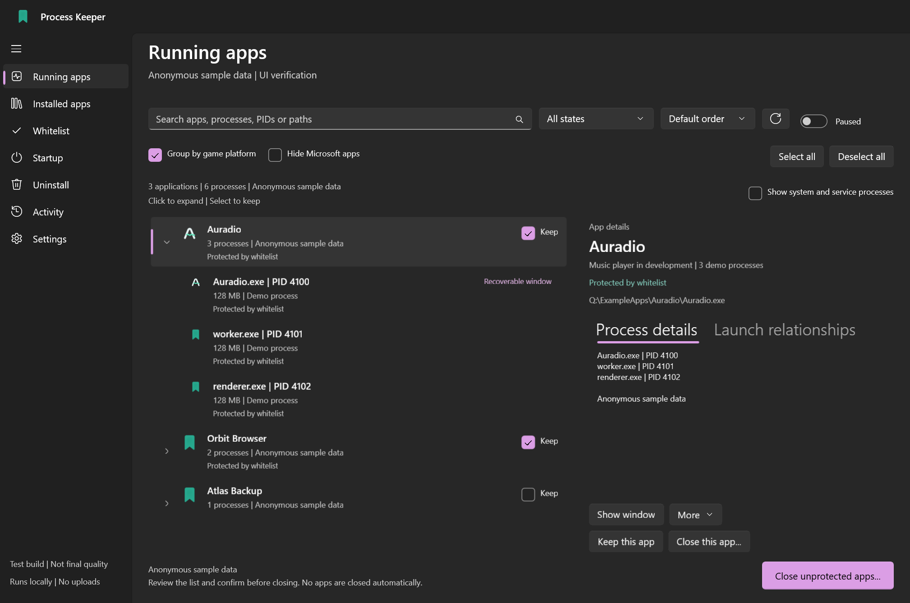
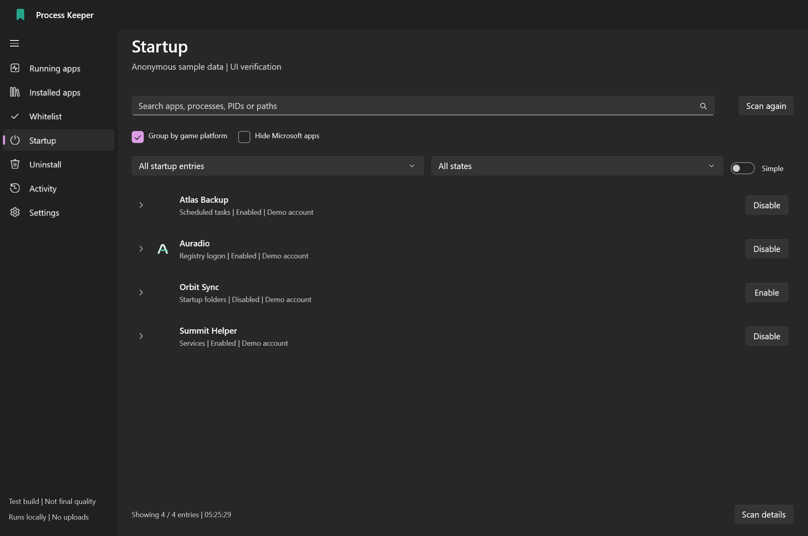
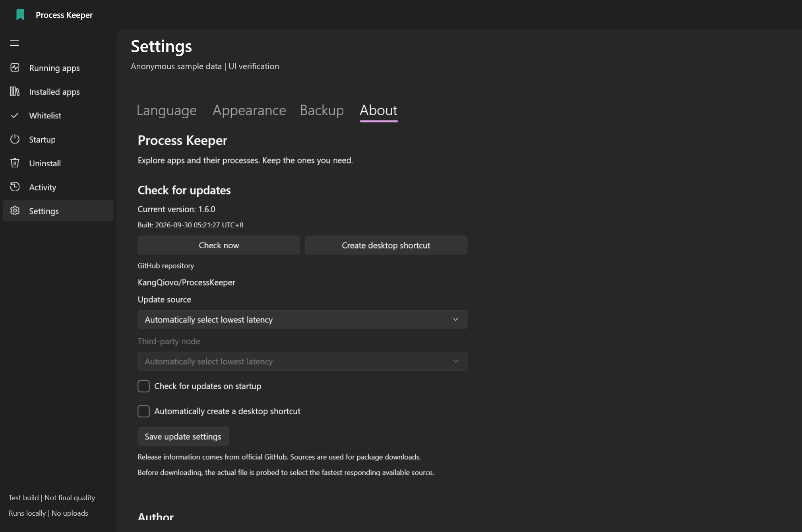
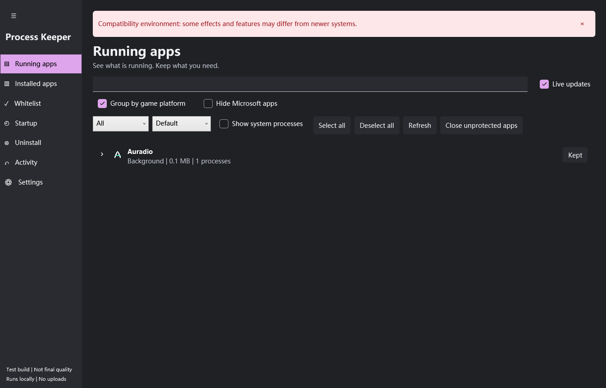
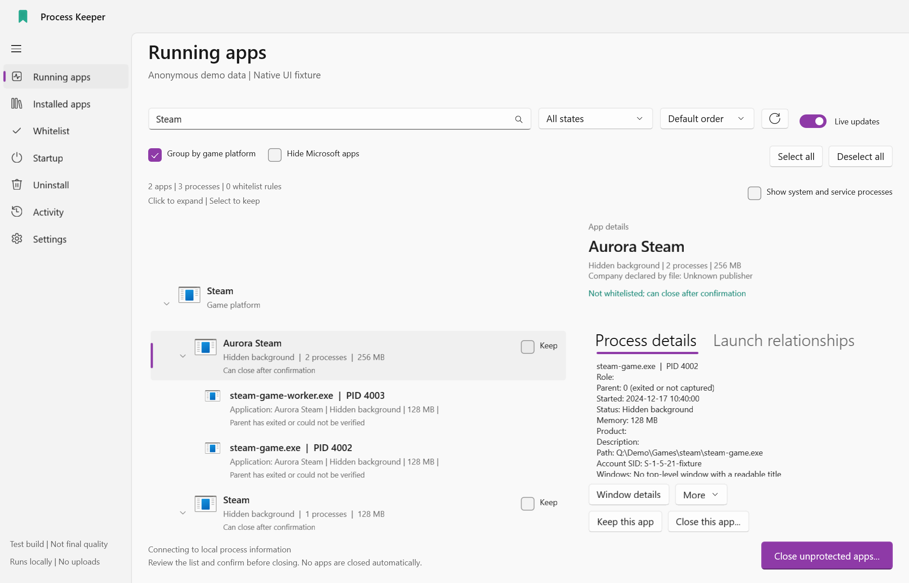
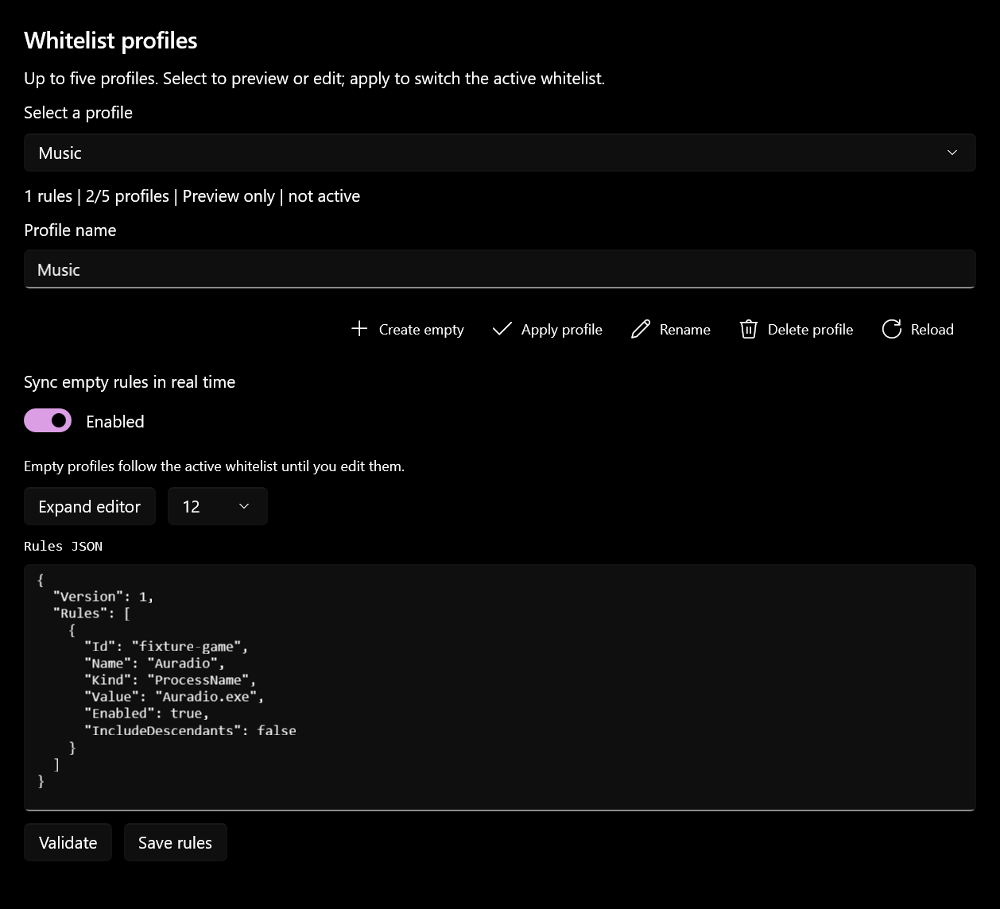
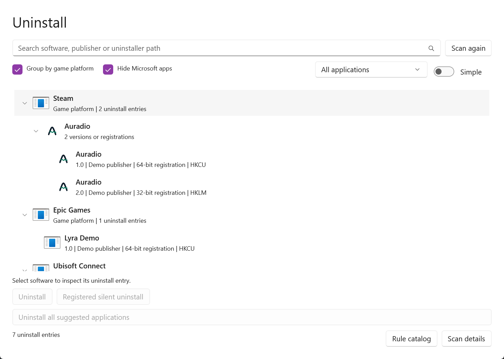
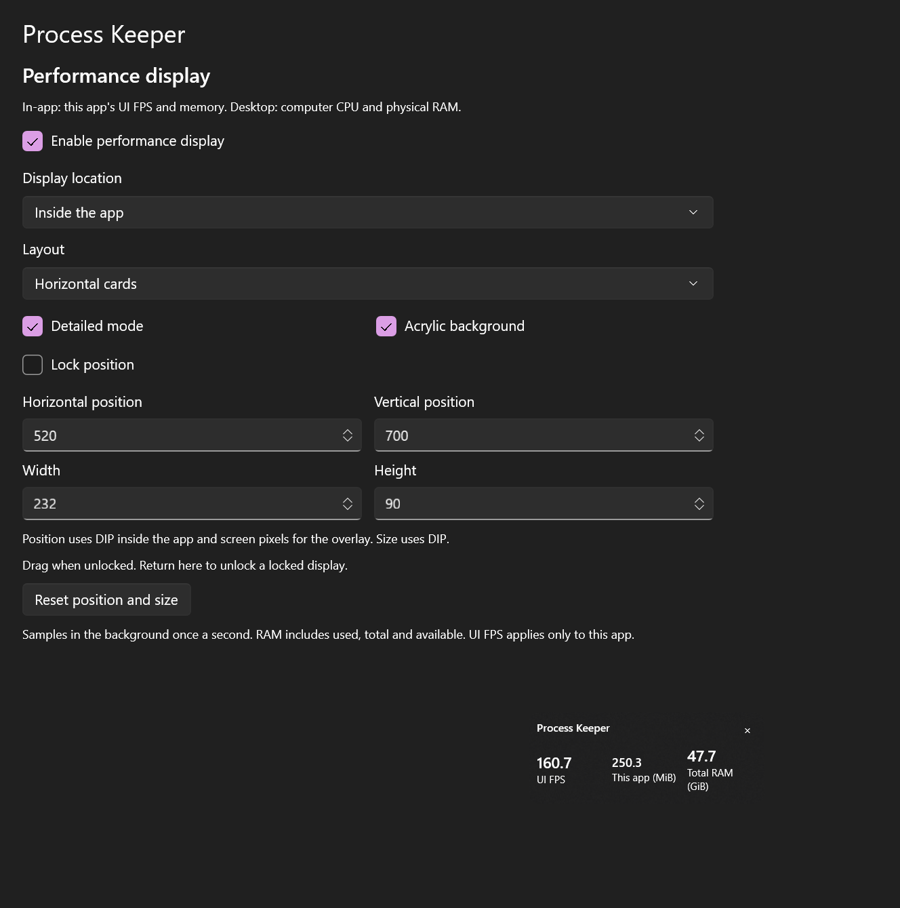
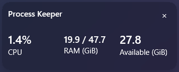

  
  <h1>Process Keeper</h1>
  
Understand what is running. Keep what matters. Close the rest deliberately.

  
<strong>English</strong> | <a href="README.zh-CN.md">简体中文</a> | <a href="README.zh-TW.md">繁體中文</a>

  

    
    
    
  

  
<a href="#features">Features</a> | <a href="#screenshots">Screenshots</a> | <a href="#compatibility">Compatibility</a> | <a href="docs/BUILDING.md">Build</a> | <a href="https://github.com/KangQiovo/ProcessKeeper/issues">Report an issue</a>

Process Keeper is a Windows application and process manager with an editable whitelist, startup management, and tools for restoring supported hidden application windows. Related processes are grouped under their application, so you can inspect what an action will affect before confirming it.

The modern interface uses **WinUI 3**. A shared **WPF / WPF UI compatibility interface** supports x86 and x64 older systems. Version **1.8v2** offers three portable editions, three installers with uninstallers, and one universal portable package.

> Download the official portable EXE from [Releases](https://github.com/KangQiovo/ProcessKeeper/releases/latest). Release packages are unsigned, so Windows may show **Unknown publisher**. Ordinary builds retain the **“Test version — does not represent final quality”** notice; official stable builds remove it. Older-system support remains a compatibility target, not completed device certification.

## Features

**1.8v2** fixes update package filtering, immediate automatic-check persistence and update dialogs on every page. Changing editions now opens a separate confirmation, and a bounded startup pass cleans verified old payloads after the updater exits. Existing same-target desktop shortcuts refresh; unrelated downloaded copies remain untouched. Display version **1.8v2** uses internal identity **1.8.1** / `v1.8.1` so 1.8 clients detect it as newer. **Hide Microsoft apps starts off** for new settings and the local whitelist is empty; saved choices are retained. [Release notes](docs/RELEASE-1.8.1.md).

Appearance also offers native backdrop tint and luminosity opacity sliders and a tint color picker. Preview changes immediately, restore native defaults, and include them in a settings backup. Material availability and Windows accessibility/transparency policy still apply; the compatibility interface retains the settings for use in the modern interface.

**1.7.1** makes row clicks expand details and reserves selection for checkboxes, fixes Microsoft Store Paint filtering, selects matching update editions by default, adds edition badges and clears leftover update packages. See the [release notes](docs/RELEASE-1.7.1.md) for all seven packages and known limitations.

| Area | What you can do |
| --- | --- |
| Running applications | Separate visible, minimized, hidden and system/service processes; expand applications to inspect identity, memory, children and windows. |
| Installed applications | Load the catalog in the background, filter by drive and whitelist software before it runs. Expand discovered executable components. |
| Whitelist | Search software and processes, inspect matches, enable/disable rules, and share portable rules or complete local backups. |
| Profiles and grouping | Keep up to five editable whitelist profiles; group Steam, Epic Games, Ubisoft Connect and EA app games; optionally hide verified Microsoft software. |
| Startup | Switch simple common/hidden categories and advanced sources; change supported entries with confirmation, backup and state revalidation. |
| Uninstall | Inspect traditional and hidden uninstall registrations; review the registered uninstaller before a confirmed normal or quiet removal. |
| Performance | See app UI FPS and memory in-app; show computer CPU and used/total physical memory in the desktop overlay. |
| Hidden windows | Restore existing windows or use dedicated actions for supported AVD, virtual-machine, browser and tray scenarios. |
| Settings | English, 简体中文 and 繁體中文; system-language detection; theme/material controls; settings backup; repeatable onboarding. |
| Activity | Live history, oldest first, including year, milliseconds and time-zone offset, with optional auto-scroll. |
| Updates | Fixed official repository, actual release notes/assets, source selection, verified update handoff and desktop shortcuts. |

## Screenshots

Each language edition uses captures of its corresponding application language. These show actual Windows controls with anonymous demonstration data on a modern Windows host. Current development captures retain the preview notice and **do not demonstrate Windows 7 or ARM64 device execution**.

**Auradio**, the author's music player in development, appears as a small demo-data easter egg. Its sample processes and whitelist entries are screenshot fixtures, not preinstalled release rules.

*Expand an application to inspect its relationship to the processes underneath it.*

| Startup management | Settings and updates |
| --- | --- |
|  |  |
| Check the source and current state before making a supported change. | Native controls, theme-aware content and explicit update confirmation. |

*The compatibility interface preserves the main workflow, with documented material and capability differences.*

| Platform grouping | Whitelist profiles |
| --- | --- |
|  |  |
| Expand a platform, game, then its processes; each app keeps its own actions. | Preview and validate rules before explicitly applying a profile. |

| Uninstall registrations | App performance display |
| --- | --- |
|  |  |
| Inspect the registered command and confirm before removal. | Actual feature controls; memory and UI callback rate are live readings from the demonstration window. |

*The optional single-line overlay shows computer CPU and used/total RAM in a small rounded panel.*

## Getting started

1. Launch the portable EXE. Windows requests administrator permission; cancelling opens the permission page instead of management.
2. Complete onboarding. Automatic language selection prefers the system display language; **Settings → About → Environment check** can inspect the environment again.
3. Review running or installed software and mark applications to keep. Click a row to expand its processes or executable components; use its checkbox to select it.
4. Choose a close action and review its exact target list. Graceful exit is the default; forced termination requires an explicit choice.
5. Read the activity log. Failures, unavailable capabilities and unverifiable identities are not counted as success.

**New installations start with an empty whitelist.** Existing users keep their own rules. Missing software produces an unmatched rule; it is not installed or launched. Portable sharing omits machine-specific rules; imported local rules default to disabled until reviewed.

In **Settings → Backup**, create up to **five named profiles**. Select one to preview its rules, edit the JSON and check its format, then save. **Apply** switches the active whitelist after confirmation; selecting an inactive profile does not change protection. Saving the active profile also asks for confirmation. Full settings backups include every profile; whitelist-only exports contain only the active rules.

The profile editor sits below the backup tools. **Sync empty rules in real time** lets an empty profile preview follow changes to the active whitelist until you type in the editor. Saving remains explicit; other profiles are untouched. The switch is remembered and included in full settings backups. Expand the editor and adjust its font size for larger rule files.

**Cloud profiles are optional.** In the profile section, load the public repository list manually, preview a file, then confirm **Import and apply**. Imports create a new profile and count toward the five-profile limit. The seven-app `kangqi-default.json` is an opt-in community template; initial local rules remain empty. Anyone can propose portable configuration files under `community/profiles/` through a Pull Request. See [Cloud profiles and co-creation](docs/CLOUD-PROFILES.md) for the schema, privacy requirements and workflow.

### Applications and processes

Running, installed and whitelist pages search application names, process names, paths and exact PIDs. A matching child keeps its parent application visible. Available details include executable identity, account/session, parent PID, services and windows. Icons come from the original local executable when readable.

A single **Select all / Deselect all** button selects the currently visible rows. Click a row, its icon or its text to expand or collapse it; this preserves selection. Only explicit checkbox clicks select individual applications or children. Rows with an available Keep/Enable action show that checkbox on the right; a successful click also selects or deselects its branch. Other rows show a matching selection checkbox in the same position, without changing protection. Selecting a parent checkbox includes every known descendant, including collapsed children; clearing it clears that branch. Partial child selection marks the selection checkbox as mixed. Keep/Enable actions retain their protection meaning, and cancelled actions preserve selection. In the whitelist page, choose which pages protection covers: Running and Installed by default, with optional Startup and Uninstall scopes. Full settings backups retain these choices.

Application grouping combines verified identity, original executable paths, and product/publisher evidence. Exact MSI shortcut/component registrations, registered icon directories and supported runtime registrations can connect records for the same product. Multiple installed versions retain their own files, main/uninstaller labels and locations; startup groups retain each source entry and enable state. Unknown or conflicting ownership and distinct package families remain separate, even when display names match. Grouping is for presentation and never substitutes a display name for an exact close, startup-change or uninstall target.

Installed executable children label explicit entry points in green, possible main files in yellow and uninstallers in red. Main candidates come first, followed by uninstallers; other components retain their inventory order. Local rules match English application names to EXE names, using file descriptions and known helper/uninstall evidence. Filename inference always remains yellow. Inferred labels may be wrong and do not establish safety or successful launch. Parent file-location actions prefer a unique resolved main executable; ambiguous entries open the folder rather than arbitrarily selecting the first EXE.

Installed-software discovery uses registrations, shortcuts and supported package metadata across drives. It does **not** promise to find every portable EXE on every disk. Dormant applications show discovered executable components and associated live processes, not a fabricated future process tree.

Running, installed, startup and uninstall lists can group games under **Steam, Epic Games, Ubisoft Connect or EA app**. Expand a platform to see the independent application rows. Membership uses supported local installation records, not process ancestry. Platform headings are display groups: expanding or collapsing one does not whitelist, close or uninstall its children. Unidentified games remain ordinary rows. **Hide Microsoft apps is off by default.** When enabled, it requires verified publisher or Windows component evidence; a company-name string alone is insufficient, and unknown items remain visible.

Only the running, installed and whitelist pages expose the shared real-time update switch. Pausing it does not pause logging. Already requested publisher verification can still complete and update display filtering while collection is paused. Lists use virtualization, bounded caches and background collection; slow disks or system providers can still delay completion.

### Closing software safely

Process identity and protection rules are rechecked before acting. Restarted or newly created processes are not silently added to a confirmed list. Bulk close follows the confirmation list, not just the current search results.

Steam receives a verified graceful shutdown request first; this cannot prove game saves or Steam Cloud synchronization completed. Supported sensitive desktop components require a separate risk confirmation and countdown. Optional risk-ignoring mode is session-only with a persistent red warning; it does not remove identity checks, critical-process protection or update confirmation.

**Save your work first.** Closing applications or changing startup configuration can interrupt work. Administrator rights do not make every protected process readable or controllable.

### Startup management

Sources include Run/RunOnce, startup folders, scheduled tasks, services, drivers, selected advanced registry mechanisms, WMI subscriptions and supported package startup declarations. Some entries trigger at login or under specific conditions, not necessarily at boot.

Simple mode groups common and other non-system entries. Advanced mode reveals detailed sources and protected entries. This is not an exact Task Manager clone or exhaustive persistence detector.

Supported entries can be enabled or disabled after confirmation. Recognized Windows startup-approval records preserve the original command or shortcut. Original state is backed up and rechecked. Drivers, system/policy entries, unknown formats and services without a safely recoverable startup type remain read-only, with an explanation. Changing configuration does not immediately start or stop the program.

### Hidden windows

| Scenario | Behavior and boundary |
| --- | --- |
| Existing main window | Restore a verified graphical window; report focus restrictions separately. |
| Android Emulator / AVD | Exclude terminals, crash handlers and internal helper windows; recommend graphical candidates. A native-window restart requires identification and confirmation. No scrcpy dependency; a visible window does not prove Android finished booting. |
| Virtual machines | Use supported VirtualBox, Hyper-V and VMware interfaces to identify and connect to an existing guest. Product availability and identity checks apply. |
| Headless browser | Supported modern Chrome/Edge instances may offer live preview through their existing verified debugging capability. The compatibility build has no live preview. |
| Tray software | Offer supported activation routes. The program may re-hide or show login; a launch request alone is not successful recovery. |

### Uninstall and performance

The **Uninstall** page combines readable 32-bit and 64-bit registrations for the machine and current user, including entries hidden from Control Panel. Search and inspect the publisher, location and registered command before confirming. System components remain read-only.

Simple mode shows system apps, third-party apps, and drivers/runtimes; advanced mode exposes registration and recommendation filters. Identical display names expand into their registered versions, architectures and scopes. Each child remains a separate uninstall target. Right-click a row to locate its files or copy its details. Missing or unusable registrations stay available in advanced mode.

The uninstall filter bar reuses the other lists' platform and Microsoft visibility controls, with the category filter on their right. Platform groups can contain expandable version groups; search retains the matching application's hierarchy. Group headings have no uninstall action.

The built-in recommendation catalog contains **68 product rules and 117 explicit aliases**, checked on **2026-09-30**, with particular attention to Chinese bundled-software reports. It separates **12 watchlist rules** (including selected 360 and Kingsoft products) from **56 rules linked to 26 first-party reports**. Details show the matching name, reason, source and available report date. These are review hints, not file-infection verdicts or a complete antivirus database. Nothing is selected or uninstalled automatically. Read the [catalog, sources and matching limits](docs/UNINSTALL-RULES.md).

The Uninstall page can **check and apply rule updates** separately from app updates. Downloads use the fixed official repository; an embedded public key verifies the maintainer's RSA-SHA256 signature before strict format and revision checks. Updates require an explicit action, never upload your app list, and retain the current rules on network or validation failure. See [signed catalog updates](docs/CATALOG-UPDATES.md).

Normal removal uses the application's registered native uninstaller. A registered quiet command is available only when present and requires an additional confirmation. The executable and registration are checked again before launch. A process exit is not reported as successful removal while the registration remains. This feature cannot guarantee removal of resistant software, discover every portable application, or safely substitute for malware remediation. It does not recursively delete application folders or drivers.

**Uninstall all suggested apps** reviews eligible recommendations from the full scan, including items outside the current search. It requires **three separate confirmations** covering the fixed application list, risks/disclaimer and final execution. Risk-ignoring mode cannot skip them. Normal uninstallers run one at a time; changed identities, failures, cancellation or an unverifiable removal stop the remaining queue. Cancelling observation does not stop an already running uninstaller.

To keep large registrations from freezing confirmation dialogs, a batch is limited to 100 recommendation records and 64,000 characters per preview. Exceeding either limit rejects the whole batch before execution; it never hides targets and proceeds. Handle some entries individually and scan again.

In **Utilities → Performance**, choose in-app or desktop placement, detail, layout, position, size and locking. The in-app panel stays inside the content area and shows UI rendering callbacks, app memory and total physical RAM. The desktop overlay shows computer CPU, physical RAM and observed desktop composition FPS, which is neither a game FPS counter nor the monitor refresh rate. A static desktop can have a low rate; unavailable data remains unavailable. Settings are included in full backups. See [Utilities](docs/UTILITIES.md) for measurement and compatibility limits.

## Compatibility

The single-file launcher's old preparation message has been replaced by the app icon, English name and a small loading ring. Preparation runs off the UI thread; the transition waits for a verified graphical application window. Startup, closing and setup card changes use eased native transitions. Reduced-motion and high-contrast settings bypass them. **Settings → About → Environment check** reruns the environment checks without resetting settings; detected issues offer official help or download links with browser confirmation.

The loading page follows the Windows app light/dark preference and updates when it changes. Its text, background and loading ring use a coordinated palette; high-contrast mode uses Windows accessibility colors. Error and permission pages retain readable native actions.

| System | Interface | Runtime |
| --- | --- | --- |
| Windows 10 2004 / build 19041+ x64; Windows 11 x64 | WinUI 3 modern UI | .NET / Windows App SDK included in packaged builds |
| Windows 10 build 19041+ ARM64; Windows 11 ARM64 | Native ARM64 WinUI 3 UI | Included runtime; native x86 bootstrapper uses Windows emulation |
| Windows 7 **SP1** x86/x64; Windows 8.1 x86/x64; older/x86 Windows 10 | x86 WPF compatibility UI | .NET Framework **4.6.2** or a compatible newer 4.x runtime |
| Windows 7 without SP1, original Windows 8, XP, Vista, ARM32 | No supported management route | Launcher explains requirements |

**Still open:** no real Windows 7 / 8.1 / 10 or ARM64 device validation has been completed. The compatibility build lacks WinRT package inventory/startup declarations, live browser preview and x64 AVD environment reconstruction. ARM64 also disables the x64-only AVD environment reader. Materials, animations, fonts, graphics behavior and old-hardware performance can differ. Cross-compilation and modern-host x86 tests do not prove device compatibility.

System-memory optimization is available with explicit confirmation, including whitelisted apps. Its global native calls have not been executed in development validation and still need device testing. Undocumented steps may be unsupported on older Windows versions. The adaptive direct-link downloader is independent of optional GitHub mirrors and cannot guarantee full bandwidth. Its implementation boundaries are explained in [Utilities](docs/UTILITIES.md). The compatibility overlay uses native acrylic only when the required backdrop and rounded-corner APIs are available; otherwise it retains the preference and uses a solid background.

Read the [compatibility matrix and known limitations](docs/COMPATIBILITY.md). Reproducible [issues](https://github.com/KangQiovo/ProcessKeeper/issues/new/choose), screenshots and focused fixes are welcome.

## Packaging, settings and updates

All portable and installed editions share one instance namespace for the current Windows user and session. A newer compatible version takes priority; at the same version, eligible native WinUI takes priority over the WPF compatibility interface. Equivalent candidates retain the latest-launch rule. A losing launch activates the retained window and exits. Replacements request cooperative closure and wait for the previous process to exit before opening the successor.

Version **1.8v2** publishes **seven packages**: three portable editions, three corresponding installers with uninstallers, and a universal portable EXE.

| Download | Choose for |
| --- | --- |
| [ProcessKeeper-v1.8.1-win7-x86-compat.exe](https://github.com/KangQiovo/ProcessKeeper/releases/download/v1.8.1/ProcessKeeper-v1.8.1-win7-x86-compat.exe) | Portable \| Win7 SP1 / 8.1 and supported newer x86/x64 systems \| WPF; requires .NET Framework 4.6.2 or compatible newer 4.x. |
| [ProcessKeeper-v1.8.1-win10-x86-x64.exe](https://github.com/KangQiovo/ProcessKeeper/releases/download/v1.8.1/ProcessKeeper-v1.8.1-win10-x86-x64.exe) | Portable \| Win10/11 x86/x64 \| WinUI on x64 build 19041+; bundled WPF compatibility UI for x86 or older supported x64 systems. |
| [ProcessKeeper-v1.8.1-win10-arm64.exe](https://github.com/KangQiovo/ProcessKeeper/releases/download/v1.8.1/ProcessKeeper-v1.8.1-win10-arm64.exe) | Portable \| Win10 build 19041+ / Win11 ARM64 \| Native ARM64 WinUI; x86 launcher under emulation. |
| [ProcessKeeper-v1.8.1-win7-x86-compat-setup.exe](https://github.com/KangQiovo/ProcessKeeper/releases/download/v1.8.1/ProcessKeeper-v1.8.1-win7-x86-compat-setup.exe) | Installer + uninstaller \| Win7 SP1 / 8.1 and supported newer x86/x64 systems. |
| [ProcessKeeper-v1.8.1-win10-x86-x64-setup.exe](https://github.com/KangQiovo/ProcessKeeper/releases/download/v1.8.1/ProcessKeeper-v1.8.1-win10-x86-x64-setup.exe) | Installer + uninstaller \| Win10/11 x86/x64 \| Includes the same modern and compatibility routes. |
| [ProcessKeeper-v1.8.1-win10-arm64-setup.exe](https://github.com/KangQiovo/ProcessKeeper/releases/download/v1.8.1/ProcessKeeper-v1.8.1-win10-arm64-setup.exe) | Installer + uninstaller \| Win10 build 19041+ / Win11 ARM64. |
| [ProcessKeeper-v1.8.1.exe](https://github.com/KangQiovo/ProcessKeeper/releases/download/v1.8.1/ProcessKeeper-v1.8.1.exe) | Universal portable \| All three runtime routes \| Largest download; historical updater-compatible PK14 format. |

Portable packages create no Programs registration but still write verified runtime caches and separate settings. Installers register Process Keeper in Windows Programs, create shortcuts and include Uninstall.exe. Installation does not widen or prefill the empty default whitelist.

Whitelist-only and complete-settings exports are separate formats. Imports show a preview; local path rules are not widened into broad name rules. Profile edits use revision checks and one atomic whitelist file, so a stale editor cannot overwrite newer rules. Complete-settings imports keep backups and attempt rollback on failure, but cannot guarantee multi-file atomicity across sudden power loss.

Update authority is fixed to **`KangQiovo/ProcessKeeper`** in configuration, official metadata, assets and installation handoff. GitHub supplies release identity and digests; third parties only supply allowed download routes. Automatic source choice measures actual asset requests. The update prompt renders the actual Markdown release notes and lists recognized application packages; the default selects the matching package and distribution type. After download, explicit confirmation performs a portable replacement or opens the standard installer wizard. A progress window supports pausing/resuming and switching sources. An active download survives navigation and repeated checks during the same app session; it does not promise recovery after closing the app. Downloading does not exit the application. Replacement starts only after an explicit Update and restart click and confirmation, with no automatic countdown. The old package backup is removed only after the replacement reports ready; unrelated EXEs are untouched. Missing releases/digests, rate limits, network errors and invalid packages are reported.

**For 1.6.x in-app upgrades, select ProcessKeeper-v1.8.1.exe (Universal).** The old updater accepts PK14 and rejects PK17 split editions or installers safely. To switch to a smaller edition or an installed copy, download its corresponding EXE manually. From 1.7.1, the default follows the verified current edition and portable/installed type. Switching compatible editions requires confirmation. Installer updates open a standard setup wizard after explicit consent; complete or cancel the wizard yourself.

Build time is preserved to the second with a UTC+8 baseline and displayed in the computer's current time zone, refreshed every five seconds. Current builds are unsigned: hash checks and fixed repository identity do not make a locally rewritten EXE impossible. Real public-release upgrades and production UAC/cache cold starts still need field testing.

### Portable files and removal

Portable packages embed the trusted updater. Installers additionally provide Uninstall.exe and an owned Programs registration. Updates retain the stable original application path, preserve the uninstaller and refresh only matching installation metadata and shortcuts.

To remove Process Keeper manually, finish or cancel pending updates, exit the application, and remove the chosen EXE and its **Process Keeper.lnk** from the actual Windows Desktop folder, which may be redirected. Optional full cleanup can also remove your `%LOCALAPPDATA%\ProcessKeeper` settings/history and the protected `%ProgramData%\ProcessKeeper\Universal\<your-user-SID>` extracted payload/session folder. Only remove your own SID folder; other users' caches must be preserved. Startup recovery backups are separate under `%ProgramData%\ProcessKeeper\AutorunBackups\<your-user-SID>`; retain them if you may need to restore startup changes. Deleting files does not reverse earlier startup modifications. The portable package creates no installer registration in Windows Programs.

When migrating manually from 1.6.x, verify the new 1.8.1 EXE works before removing the old downloaded EXE yourself. The app does not sweep nearby executables or archives.

## Build and contribute

- [Build from source](docs/BUILDING.md): modern, compatibility and native packaging steps.
- [Testing](docs/TESTING.md): fixtures, evidence and remaining validation gaps.
- [Contributing](CONTRIBUTING.md): bugs, translations, accessibility and older-system reports.
- [Security](SECURITY.md): reporting guidance and sensitive data.

Source, generic rule examples, docs and screenshots belong in Git. Binaries, test packages, caches, personal rules and logs do not. There is no automatic binary-release publishing workflow.

## Credits and license

The About page shows KangQi's circular GitHub avatar above the author name, aligned left. A bounded background request starts once at app startup and stays in memory; changing pages or language does not start another download. GitHub is tried first, followed by the configured fixed public-avatar proxy routes when necessary. No app inventory or settings are sent. If all sources fail, the avatar is hidden without a placeholder. These image requests are independent of release-update preferences.

Created by **KangQi**: [GitHub](https://github.com/KangQiovo) | [Coolapk](https://www.coolapk.com/u/21241695) | [Bilibili](https://space.bilibili.com/329073257).

Built with references from [Microsoft WinUI Gallery](https://github.com/microsoft/WinUI-Gallery), [Windows App SDK](https://github.com/microsoft/WindowsAppSDK), [.NET](https://github.com/dotnet/runtime) and [WPF UI](https://github.com/lepoco/wpfui). [Third-party notices](THIRD-PARTY-NOTICES.md) describe components, icons and licenses. This project is independent of Microsoft and the software it displays.

Process Keeper source uses the [MIT license](LICENSE). Third-party components retain their licenses and trademarks. The application icon was AI-generated; screenshots are actual UI captures, not generated images.

## Installers and removal

Installers are compiled with pinned NSIS 3.13 and request administrator permission. They register an owned machine-wide Programs entry, install a stable ProcessKeeper.exe plus Uninstall.exe and install.ini, and create matching shortcuts. The uninstaller removes only its owned application files, links and registration; it preserves settings/history and startup recovery backups. Optional manual own-user data cleanup is described in the README. Installation/uninstallation on Win7, x86 and ARM64 remains unverified on real target systems.

In **Settings → About → Local files**, **Clear app cache** removes verified old-version caches and inactive, application-owned update packages, incomplete downloads and prepared update stages. Current payloads, active downloads, files in use, unverified content, whitelist profiles and settings are retained. Unconfirmed or modified cache trees are not recursively erased; the result reports actual files, bytes and retained trees.
