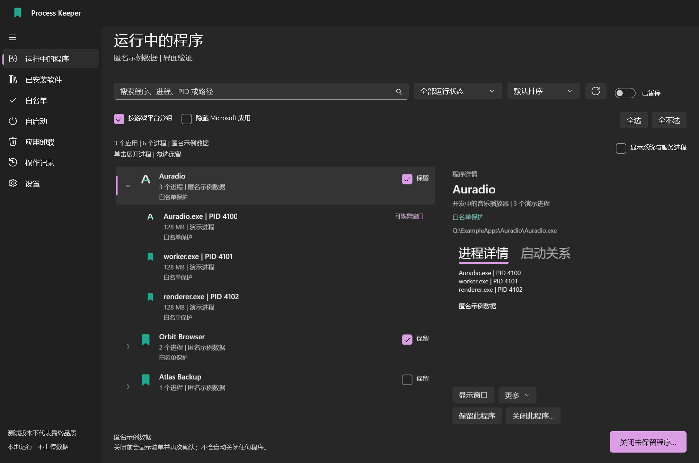
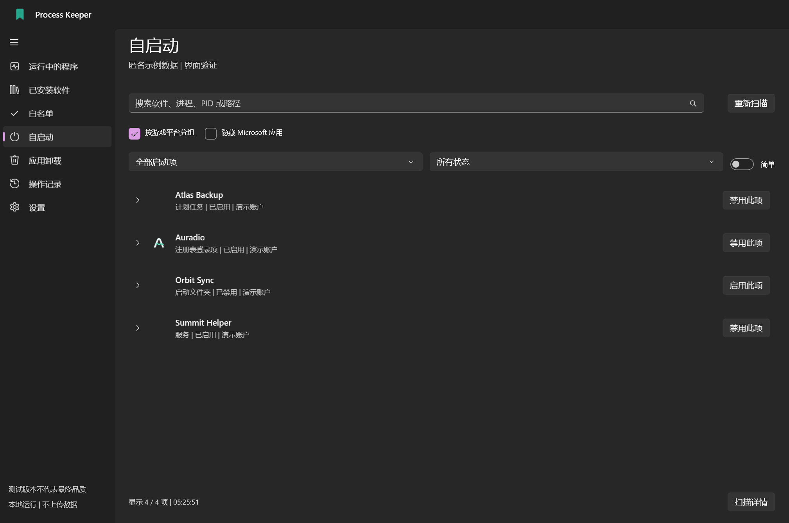
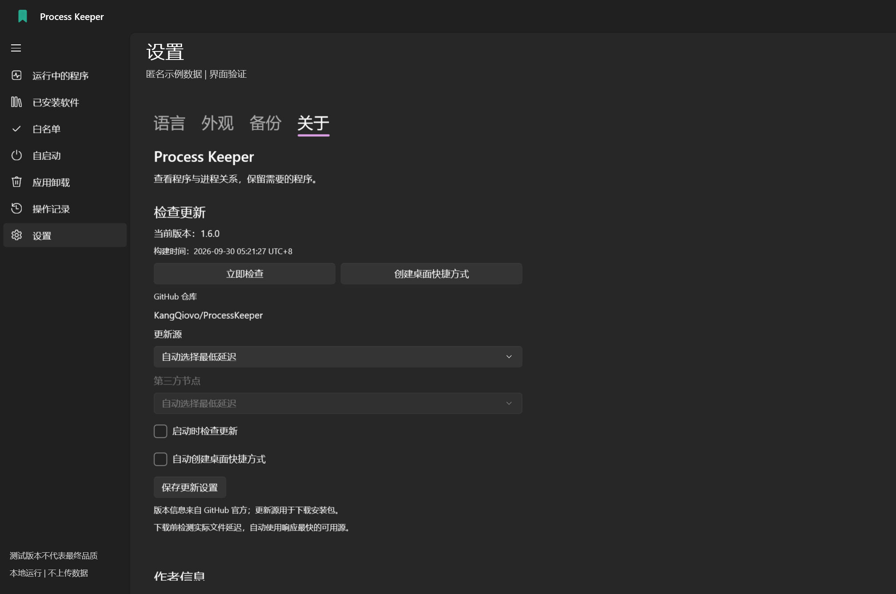
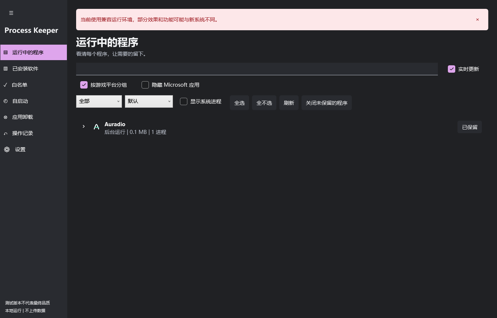
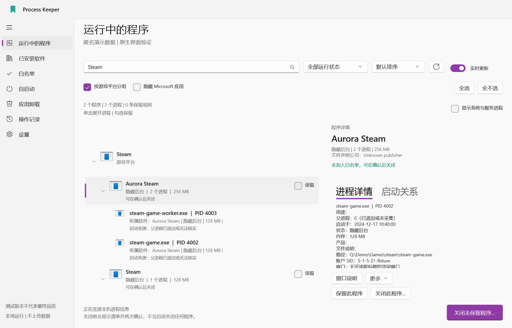
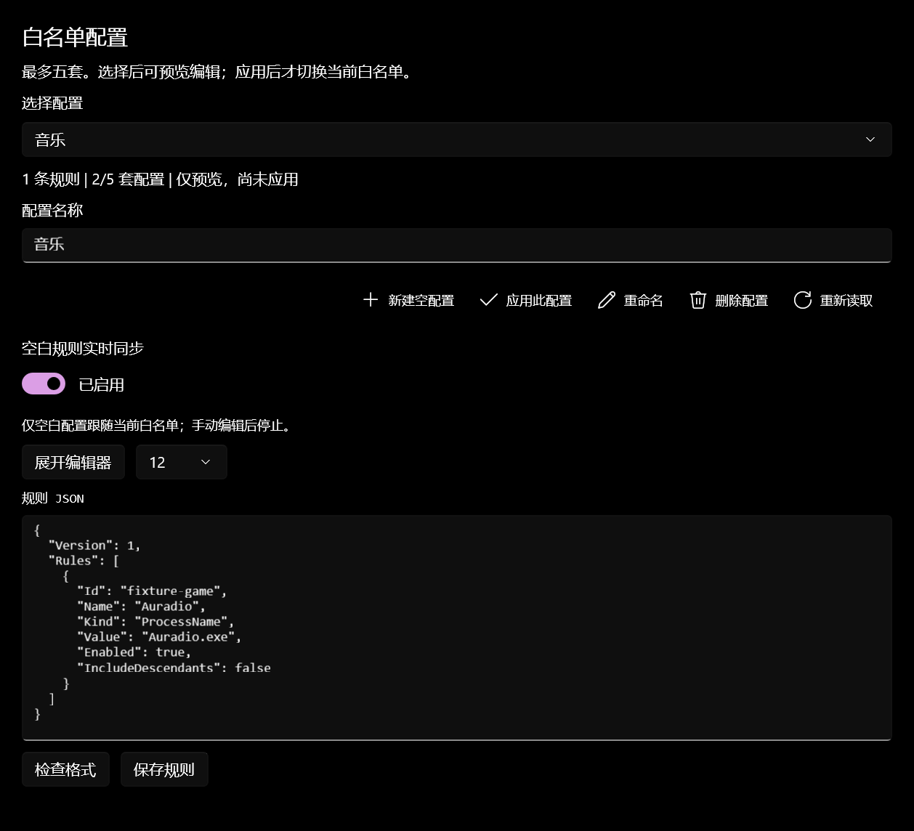
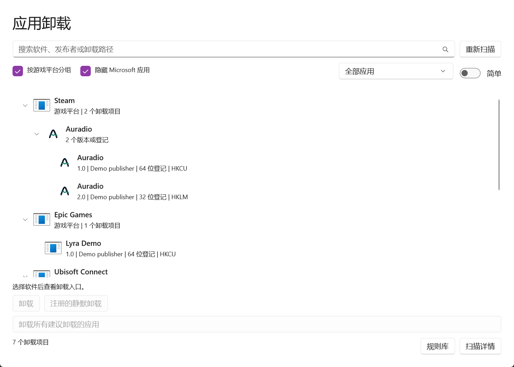
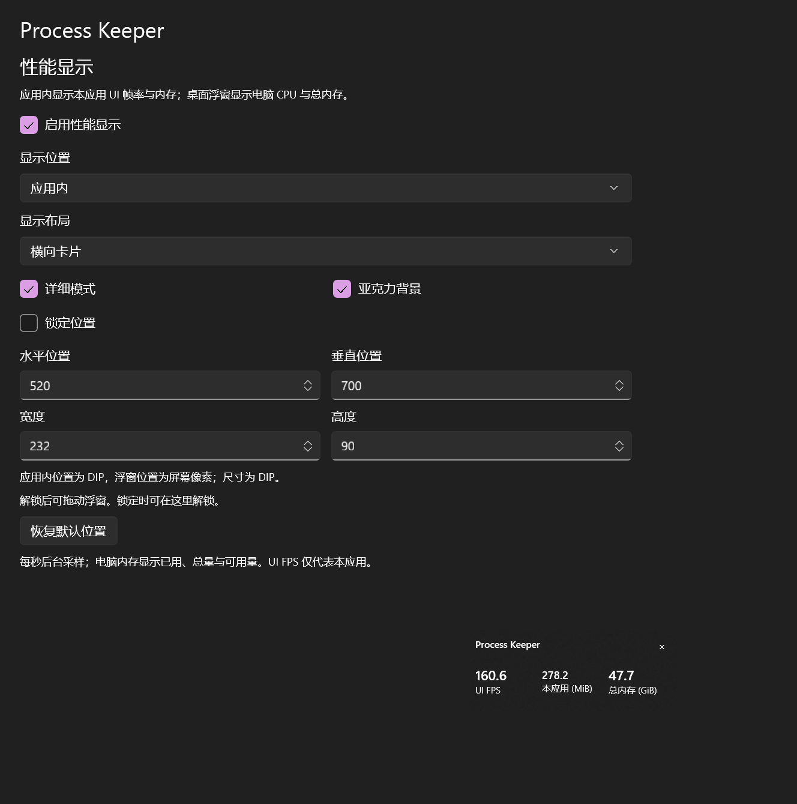
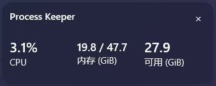

  
  <h1>Process Keeper</h1>
  
看清正在运行的软件，保留需要的程序，确认后再关闭其余程序。

  
<a href="README.md">English</a> | <strong>简体中文</strong> | <a href="README.zh-TW.md">繁體中文</a>

  
<a href="LICENSE">MIT 开源</a> | <a href="docs/COMPATIBILITY.zh-CN.md">现代与兼容界面</a> | <a href="https://github.com/KangQiovo/ProcessKeeper/issues">欢迎反馈</a>

Process Keeper 是 Windows 软件与进程管理工具，提供可编辑白名单、自启动管理，以及针对部分隐藏窗口的恢复功能。它按软件组织相关进程，让你在确认操作前看清影响范围。

现代界面使用 **WinUI 3**；**x86 WPF / WPF UI 兼容界面**共用核心逻辑，为旧系统提供另一条运行路线。原生启动器可将两套界面打包成一个免安装 EXE。

> 从 [Releases](https://github.com/KangQiovo/ProcessKeeper/releases/latest) 下载官方免安装 EXE。发行包尚未进行可信代码签名，Windows 可能显示**未知发布者**。普通构建保留“测试版本不代表最终品质”提示，官方正式构建移除该提示。旧系统支持仍是兼容目标，不代表已经完成所有设备认证。

## 功能一览

**1.6.0** 新增应用卸载、签名建议库、杂项、确认后执行的整机内存优化、可续传下载器、原生 ARM64 打包、可执行组件角色标签及性能显示改进。列表刷新保留选择状态，每行仅显示一个靠右勾选框，游戏平台分组保留游戏原有本地图标；杂项位于侧栏设置下方。真机兼容性边界见下文。

| 页面或功能 | 可以做什么 |
| --- | --- |
| 运行中程序 | 区分可见、最小化、隐藏及系统/服务进程；展开软件查看身份、内存、子进程和窗口。 |
| 已安装应用 | 后台加载目录，按盘符筛选，在运行前加入白名单，展开查看发现的可执行组件。 |
| 白名单 | 搜索软件和进程，查看匹配，启停规则，分享通用规则或备份本机完整规则。 |
| 配置与分组 | 最多五套可编辑白名单；按 Steam、Epic Games、Ubisoft Connect、EA app 分组游戏；可选隐藏已核实的微软软件。 |
| 自启动 | 切换简单的常规/隐藏分类与复杂来源；对支持的项目确认后备份、复核并启用或禁用。 |
| 应用卸载 | 查看常规及隐藏卸载登记；核对卸载程序后，确认执行正常卸载或已登记的静默卸载。 |
| 性能显示 | 应用内查看界面 FPS、应用占用和总内存；桌面悬浮窗查看电脑 CPU 与已用/总物理内存。 |
| 隐藏窗口 | 恢复已有窗口，或为支持的 AVD、虚拟机、浏览器及托盘场景提供专用操作。 |
| 设置 | 英文、简中、繁中；优先跟随系统语言；主题/材质开关；备份；重新进入引导。 |
| 操作记录 | 实时记录、最早时间在上，显示年份、毫秒、时区，可选自动滚动。 |
| 更新 | 固定官方仓库，展示真实日志和附件，选择下载源，校验更新交接及创建桌面快捷方式。 |

## 界面截图

各语言文档分别使用对应应用语言的截图。以下来自现代 Windows 主机上的实际控件，采用匿名演示数据；当前开发版保留测试提示，**不代表 Windows 7 或 ARM64 设备上的实测证据**。

**Auradio** 是作者开发中的音乐播放器，作为演示数据彩蛋出现在截图中。其示例进程与白名单仅用于截图，不会预置到发布包的规则里。

*展开软件，直观看到软件与其进程的关系。*

| 自启动管理 | 设置与更新 |
| --- | --- |
|  |  |
| 修改前核对来源和当前状态。 | 原生控件、随主题变化的内容及明确的更新确认。 |

*兼容界面保留主要流程，材质和能力差异在文档中明确说明。*

| 游戏平台分组 | 白名单配置 |
| --- | --- |
|  |  |
| 展开平台、游戏，再查看进程；每个软件保留独立操作。 | 先预览、编辑及校验，再明确应用当前配置。 |

| 卸载注册项 | 应用性能显示 |
| --- | --- |
|  |  |
| 核对注册的卸载命令，确认后再移除。 | 实际功能控件；内存与 UI 回调帧率来自演示窗口的实时采样。 |

*可选的单行布局在小巧的圆角悬浮窗中显示电脑 CPU 与已用/总内存。*

## 开始使用

1. 打开免安装 EXE，Windows 会请求管理员权限；取消后进入权限提示页，不进入管理功能。
2. 完成环境检查和引导，选择语言。自动判断优先系统显示语言。
3. 查看运行中或已安装软件，将需要的程序设为保留；点击行查看关联进程或可执行组件。
4. 发起关闭操作，核对具体目标清单。默认请求正常退出，强制结束需要明确选择。
5. 查看操作记录。失败、能力缺失或身份无法核实不会计为成功。

**新安装默认白名单为空**，已有用户保留原有规则。对方电脑没有的软件只会显示规则未匹配，不会自动安装或启动。分享导出省略本机规则，导入的本机规则默认停用，待用户核对。

在**设置 → 备份**中最多创建**五套具名配置**。选择后预览规则，可编辑 JSON、检查格式并保存。点击“应用”并确认后才切换当前白名单，选择其他配置不会改变保护范围；保存当前配置也需确认。全部设置备份包含所有配置，仅白名单导出只包含当前规则。

白名单配置位于备份工具下方。“空白规则实时同步”让空白配置的预览跟随当前白名单变化，手动编辑后停止。仍需点击保存，其他配置不会被自动修改。开关状态会保存，也包含在全部设置备份中。编辑框可展开，并可调整字号。

**云端配置需主动获取。** 在配置区域手动加载公开仓库列表，预览文件，再确认**导入并应用**；导入会创建新配置，也计入最多五套限制。七个应用的 `kangqi-default.json` 只是可选共创模板，首次本地规则仍为空。所有用户都可通过 Pull Request 向 `community/profiles/` 提交便携配置。格式、隐私要求及流程见[云端配置共创说明](docs/CLOUD-PROFILES.zh-CN.md)。

### 软件、进程与搜索

运行中、已安装和白名单页面都支持软件名、进程名、路径及精确 PID 搜索。命中子进程后保留所属软件，详情可显示可执行身份、账户/会话、父 PID、服务和窗口。可读取时使用原软件图标。

安装目录根据各盘安装登记、快捷方式及支持的应用包元数据发现，**不保证找出每个盘上的所有绿色 EXE**。未运行软件展示已发现的可执行组件和当前关联进程，不虚构未来的进程树。

运行中、已安装、自启动及应用卸载列表可按 **Steam、Epic Games、Ubisoft Connect、EA app** 分组。展开平台查看独立软件行，归属依据支持的本机安装记录，而非进程父子关系。平台标题仅用于展示，展开或收起不会自动保留、关闭或卸载整组游戏；未识别游戏仍作为普通行展示。“隐藏微软应用”需要核实发布者或 Windows 组件证据，不能仅凭公司名称判断，未知项目仍保留可见。

只有运行中、已安装及白名单三个列表页提供同步的实时更新开关，暂停不影响操作记录。列表采用虚拟化、有界缓存及后台采集；慢速磁盘或系统提供程序仍可能延迟返回。

一个**全选 / 全不选**按钮选择当前可见行。主项目及子项可直接单击多选，使用箭头展开。有保留或启用功能的行，仅在右侧显示该操作勾选框；点击行本身选择目标，由原生高亮表示。没有保护操作框的行，显示同样式的右侧选择框。选择本身不会更改白名单。白名单页可选择生效范围，默认运行中和已安装应用，可选自启动和应用卸载，全部设置备份保留这些选择。 勾选主项目的选择框会选择全部子项，包括尚未展开的内容；取消则清除整组选择。仅选择部分子项时，主项目显示部分选中。保留或启用框仍执行原有保护操作。

已安装应用的可执行子项以绿色标明显式入口，黄色标明可能的主程序，红色标明卸载程序。主程序与可能的主程序排在最前，其后是卸载程序，其余组件保持原顺序。本地规则会匹配英文应用名称与 EXE 名称，结合文件描述、已知辅助用途及卸载记录；名称推断始终为黄色提示。推断标签可能出错，不证明安全或一定能运行。主项目定位优先使用唯一识别的主程序；候选歧义时打开目录，不任意选第一个 EXE。

### 关闭程序与系统保护

执行前重新核对进程身份及保护规则；新启动或重新出现的进程不会自动追加到已确认清单。批量关闭以确认清单为准，不只针对当前搜索可见项。

Steam 优先收到核实后的正常退出请求，但这无法证明游戏已经存档或 Steam 云同步完成。支持的敏感桌面组件有单独风险确认和倒计时。“无视风险”模式只在本次运行有效，并持续显示红色警告；它不会解除身份核验、关键系统进程保护或更新确认。

**操作前请保存工作。** 关闭程序和修改自启动会中断任务，管理员权限也不保证所有受保护进程可读或可控。

### 自启动管理

来源包括 Run/RunOnce、启动文件夹、计划任务、服务、驱动、部分高级注册表机制、WMI 订阅及支持的应用包启动声明。有些项目在登录或特定条件下触发，不等于开机立即运行。

简单模式区分常规及其他非系统入口；复杂模式显示详细来源和受保护项目。它不宣称与任务管理器逐项一致，也不能穷尽所有持久化机制。

支持的项目可确认后启停；已识别的 Windows 启动审批记录保留原始命令或快捷方式。修改前备份并复核原状态。驱动、系统/策略、未知格式，以及无法安全恢复启动类型的服务保持只读并说明原因。修改配置不会立即启动或结束对应程序。

### 隐藏窗口

| 场景 | 行为与边界 |
| --- | --- |
| 已有主窗口 | 恢复已核实的图形窗口，单独报告前台焦点限制。 |
| Android 模拟器 / AVD | 排除终端、崩溃处理器和内部辅助窗口，推荐图形候选。需要原生窗口重启时先识别、再确认。无需 scrcpy；窗口出现不代表 Android 启动完成。 |
| 虚拟机 | 通过支持的 VirtualBox、Hyper-V、VMware 接口识别并连接现有虚拟机，受软件可用性与身份检查限制。 |
| 无头浏览器 | 部分现代 Chrome/Edge 可通过已有且核实的调试能力预览；兼容版没有实时预览。 |
| 托盘程序 | 尝试支持的唤起入口；程序可能再次隐藏或显示登录页，发出启动请求不等于恢复成功。 |

### 应用卸载与性能显示

**应用卸载**汇总本机与当前用户可读取的 32 位、64 位卸载登记，包括控制面板隐藏的项目。先搜索并核对发布者、位置及卸载命令，再确认执行；系统组件保持只读。

简单模式按系统应用、第三方应用、驱动与运行库筛选；复杂模式提供登记来源与建议标签等筛选。同名软件可展开查看所有登记版本、架构及范围，每个子项仍独立卸载。右键可定位文件或复制信息；无效或不可执行的登记保留在复杂模式中。

卸载页筛选栏复用其他列表的平台分组和隐藏微软应用控件，分类筛选位于右侧。平台内可继续展开软件的各版本，搜索时保留匹配项的层级；分组标题没有卸载操作。

内置建议库包含 **68 条软件规则、117 个明确别名**，来源核对日期为 **2026-09-30**，重点覆盖国内捆绑推广软件报告。它区分 **12 条关注名单**（含部分 360、金山产品）和 **56 条关联 26 份第一方报告的规则**。详情显示匹配名、原因、来源及可取得的报告日期。这些是核对提示，不是文件感染判定或完整病毒库；不会自动勾选或卸载。完整内容见[规则清单、来源与匹配边界](docs/UNINSTALL-RULES.zh-CN.md)。

卸载页可独立**检查并应用规则更新**。下载地址固定为官方仓库，内置公钥先验证维护者的 RSA-SHA256 签名，再严格检查格式和修订号。更新需要用户主动操作，不上传应用清单；网络或校验失败时保留当前规则。详见[签名规则库更新](docs/CATALOG-UPDATES.zh-CN.md)。

正常卸载调用软件已登记的原生卸载程序；仅在存在静默卸载命令时提供该操作，并再次确认。执行前复核文件与登记，卸载进程退出但登记仍存在时不会报告完成。无法保证移除有自我保护的软件，也不能发现全部绿色软件或替代恶意软件清理工具；不会递归删除程序目录或驱动。

**卸载所有建议卸载的应用**使用整份扫描清单中的可卸载建议项，包括当前搜索范围以外的项目。执行前必须经过**三次独立确认**，分别核对固定应用名单、风险与免责声明、最终执行；无视风险模式也不能跳过。正常卸载程序逐个运行；身份变化、失败、取消或无法核实移除时停止后续队列。取消等待不会停止已运行的卸载程序。

为避免大量注册数据卡住确认弹窗，每批最多包含 100 条建议记录，每张预览最多 64,000 字符。超过上限会在执行前拒绝整批操作，不会隐藏部分目标后继续卸载；可先逐项处理部分软件，再重新扫描。

在**杂项 → 性能显示**选择应用内或桌面位置，调整详细程度、布局、位置、大小和锁定。应用内显示限制在内容区，展示界面回调帧率、应用占用及总物理内存。桌面悬浮窗展示整机 CPU、物理内存及实际观察到的桌面合成帧率，后者不是游戏 FPS 或屏幕刷新率，静止桌面可能很低，未知数据不伪造。设置包含在全部备份中，测量和兼容性边界见[杂项说明](docs/UTILITIES.zh-CN.md)。

## 系统兼容性

单文件启动器原有的初始化文字已替换为应用图标、英文名称与小型加载圆环。准备工作在后台执行，核实真正的图形应用窗口后才过渡。启动、关闭及引导卡片切换采用原生缓动过渡；系统关闭动画或启用高对比度时跳过。**设置 → 关于 → 运行环境检测**可重新检测，不重置设置；异常项提供官方说明或下载链接，打开浏览器前再次确认。

加载页跟随 Windows 应用的深浅模式，并响应主题变化。文字、背景和加载圆环一起调整，高对比度模式使用系统辅助功能配色；错误和权限页面保留可读的原生操作按钮。

| 系统 | 界面 | 运行依赖 |
| --- | --- | --- |
| Windows 10 2004 / 19041 及以上 x64、Windows 11 x64 | WinUI 3 现代界面 | 打包版内置 .NET / Windows App SDK |
| Windows 10 19041 及以上 ARM64、Windows 11 ARM64 | 原生 ARM64 WinUI 3 | 内置运行时；x86 原生启动器通过 Windows 模拟运行 |
| Windows 7 **SP1** x86/x64、Windows 8.1 x86/x64、较旧或 x86 Windows 10 | x86 WPF 兼容界面 | .NET Framework **4.6.2** 或适用的较新 4.x |
| 无 SP1 的 Win7、最初版 Win8、XP、Vista、ARM32 | 无受支持的管理路线 | 启动器说明要求 |

**仍存在的问题：** 尚未完成真实 Win7 / Win8.1 / Win10 或 ARM64 设备验证。兼容版缺少 WinRT 应用包及其启动声明、浏览器实时预览、x64 AVD 环境还原；ARM64 也禁用仅适用于 x64 的 AVD 环境读取器。材质、动画、字体、显卡行为和旧硬件性能可能不同。交叉编译及现代主机的 x86 测试不能证明设备兼容。

整机内存优化需明确确认，白名单不豁免。开发验证未执行整机清理的原生调用，仍需真机测试，未公开步骤在旧系统上可能不支持。下载器与实现边界见[杂项说明](docs/UTILITIES.zh-CN.md)。兼容悬浮窗仅在所需材质和圆角接口都可用时使用原生亚克力，否则保留偏好并使用纯色背景。

请先阅读[兼容矩阵与已知限制](docs/COMPATIBILITY.zh-CN.md)。欢迎通过 [Issue](https://github.com/KangQiovo/ProcessKeeper/issues/new/choose) 提供复现步骤、截图和改进建议。

## 免安装、设置和更新

目标发行形式为包含两套界面的单个原生 EXE。免安装指不登记安装项，**不代表零写入**：校验后的运行组件使用受限 ProgramData 缓存，个人设置和日志保存在 `%LOCALAPPDATA%\ProcessKeeper`，自启动备份使用受保护的 ProgramData 目录。

仅白名单与全部设置是两种导出格式，导入先预览，不把本机路径规则擅自扩大为进程名规则。配置编辑采用版本核验及单文件原子保存，过期编辑不会覆盖更新后的规则。全部设置导入保存备份，写入失败尝试回滚，但无法保证突然断电时多文件原子提交。

更新来源身份在配置、官方元数据、附件和安装交接中固定为 **`KangQiovo/ProcessKeeper`**。版本身份和摘要来自 GitHub，第三方只提供允许的下载入口；自动选源实测目标文件请求。没有发行版、缺少摘要、限流、网络错误和无效包均如实显示，重启需确认。

构建时间精确到秒，以 UTC+8 为基准，界面每五秒按电脑当前时区刷新。当前构建未签名，摘要及固定仓库不能绝对阻止他人重写 EXE。真实公开版本升级及生产 UAC/缓存首次启动仍待现场验证。

## 编译与参与

- [源码构建](docs/BUILDING.zh-CN.md)：现代、兼容、原生打包步骤。
- [测试说明](docs/TESTING.zh-CN.md)：夹具、证据及尚未验证的范围。
- [贡献指南](CONTRIBUTING.zh-CN.md)：问题修复、翻译、无障碍和旧系统反馈。
- [安全说明](SECURITY.zh-CN.md)：报告建议与敏感数据处理。

仓库仅包含源码、通用规则示例、文档与截图，不提交二进制、测试包、缓存、个人规则及日志，也不自动发布 EXE。

## 作者、致谢与许可

关于页在作者名称上方靠左显示 KangQi 的 GitHub 圆形头像。应用启动时仅在后台请求一次，结果只保存在内存中，切换页面或语言不会重复下载。先尝试 GitHub，必要时依次尝试固定的公开头像代理入口，不发送应用清单或设置。全部来源失败则隐藏头像，不显示占位图；头像请求独立于版本更新设置。

作者 **KangQi**：[GitHub](https://github.com/KangQiovo) | [酷安](https://www.coolapk.com/u/21241695) | [Bilibili](https://space.bilibili.com/329073257)。

参考并使用 [Microsoft WinUI Gallery](https://github.com/microsoft/WinUI-Gallery)、[Windows App SDK](https://github.com/microsoft/WindowsAppSDK)、[.NET](https://github.com/dotnet/runtime)、[WPF UI](https://github.com/lepoco/wpfui)。组件、图标和授权见[第三方声明](THIRD-PARTY-NOTICES.zh-CN.md)。本项目独立于 Microsoft 及列表中显示的软件。

项目源码采用 [MIT 许可](LICENSE)，第三方组件保留各自许可和商标权。应用图标由 AI 生成；截图来自实际界面，并非生成图片。
