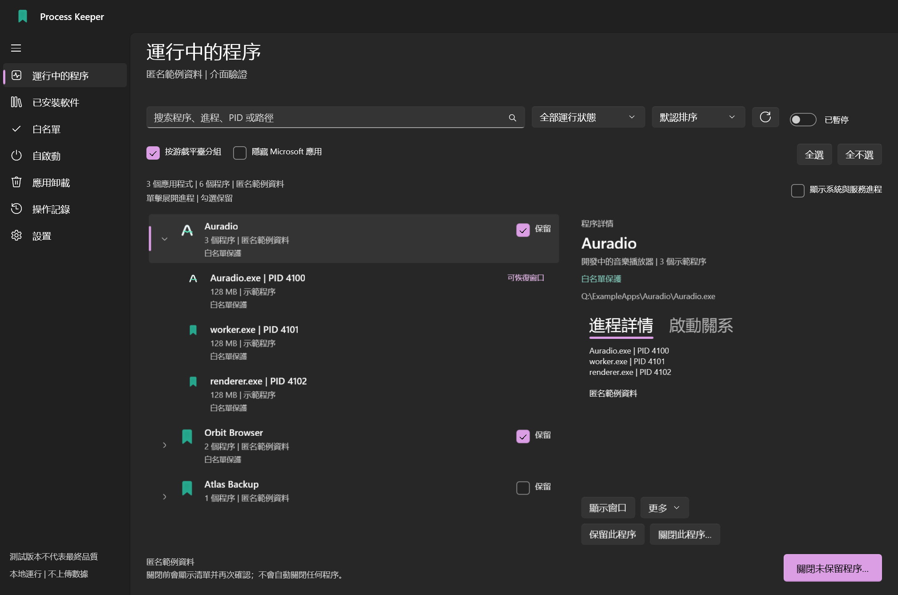
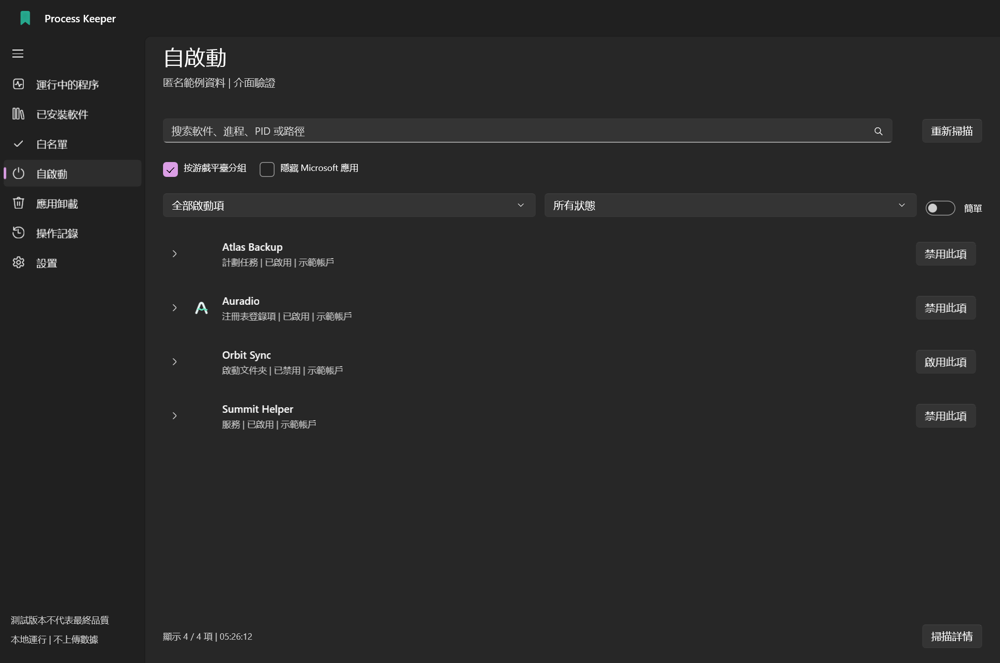
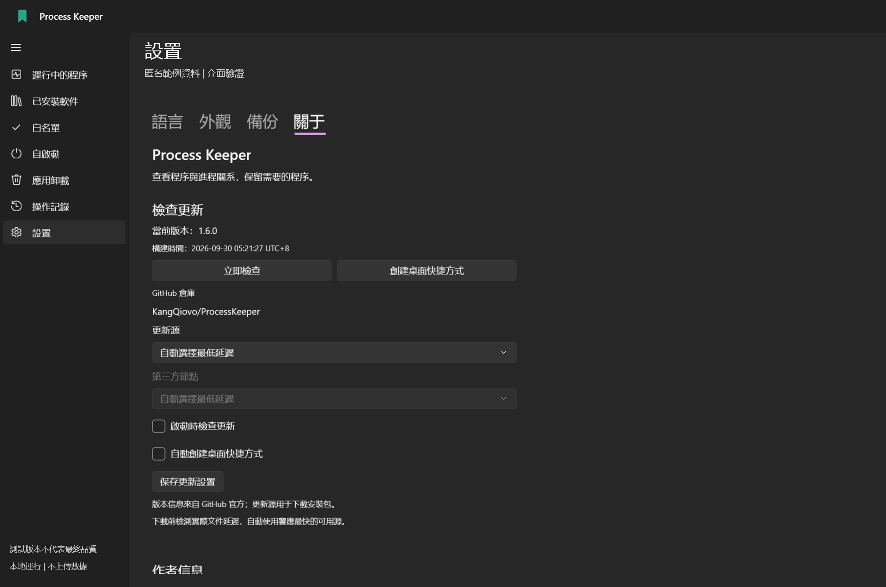
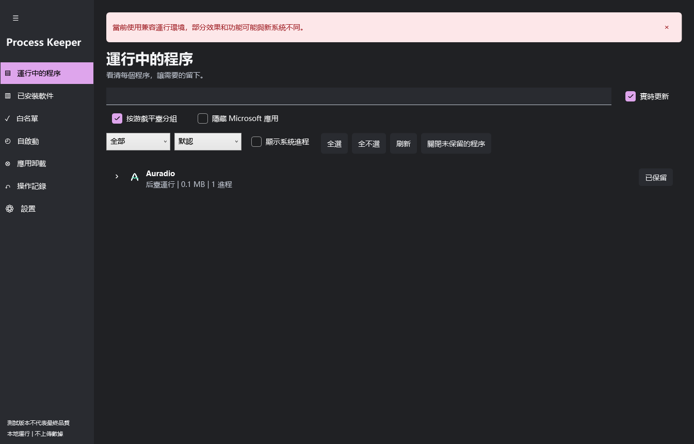
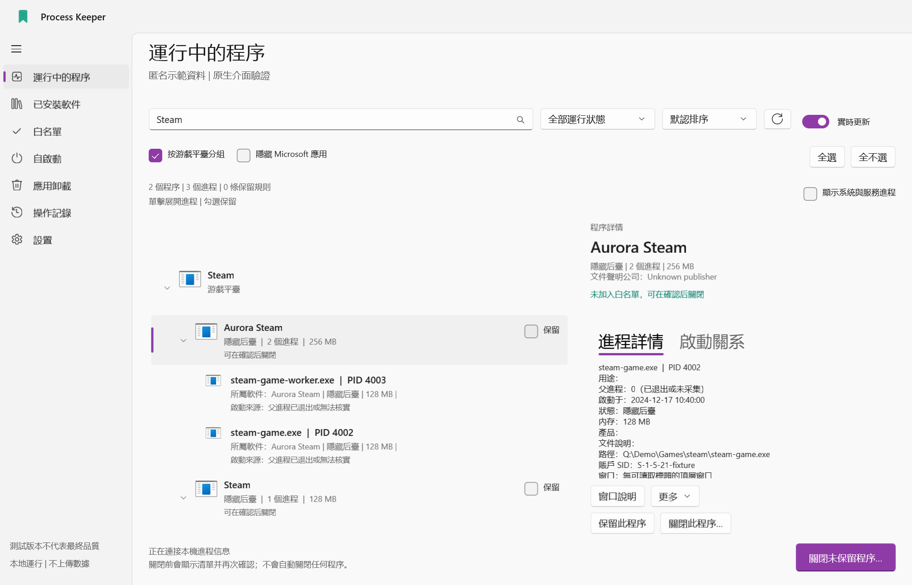
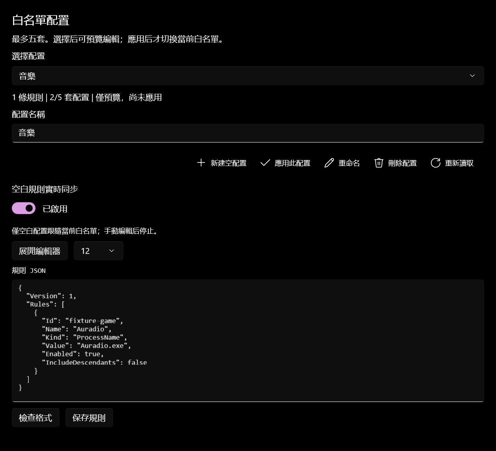
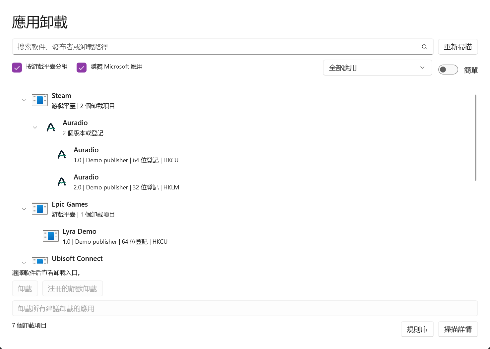
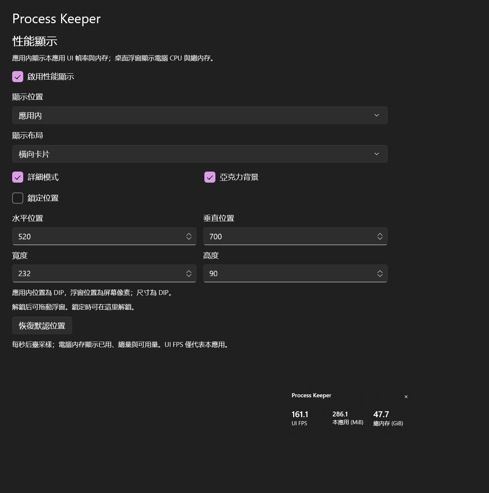
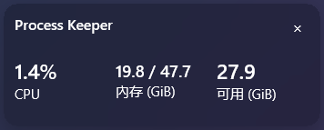

  
  <h1>Process Keeper</h1>
  
看清正在執行的軟體，保留需要的程式，確認後再關閉其餘程式。

  
<a href="README.md">English</a> | <a href="README.zh-CN.md">简体中文</a> | <strong>繁體中文</strong>

  
<a href="LICENSE">MIT 開源</a> | <a href="docs/COMPATIBILITY.zh-TW.md">現代與相容介面</a> | <a href="https://github.com/KangQiovo/ProcessKeeper/issues">歡迎回報</a>

Process Keeper 是 Windows 軟體與處理程序管理工具，提供可編輯的白名單、啟動項目管理，以及針對部分隱藏視窗的還原功能。相關處理程序依所屬軟體分組，讓你在確認操作前看清影響範圍。

現代介面使用 **WinUI 3**；共用核心的 **WPF / WPF UI 相容介面**支援舊系統及 x86、x64。1.7.0 提供三個免安裝版本、三個附解除安裝程式的安裝版本和一個免安裝整合包。

> 從 [Releases](https://github.com/KangQiovo/ProcessKeeper/releases/latest) 下載官方免安裝 EXE。發行套件尚未取得可信程式碼簽章，Windows 可能顯示**未知的發行者**。一般建置保留「測試版本不代表最終品質」提示，官方正式建置會移除。舊系統支援仍是相容目標，不代表已完成所有裝置認證。

## 功能一覽

**1.7.0** 合併重複應用主項目，重點改善已安裝應用與啟動項目，並保留全部元件路徑及準確管理目標。新增 Markdown 更新日誌、續傳下載、驗證後背景更新、安裝包及快取清理。七種檔案及遷移說明見 [1.7.0 更新說明](docs/RELEASE-1.7.0.zh-TW.md)。

| 頁面或功能 | 可以做什麼 |
| --- | --- |
| 執行中的程式 | 區分可見、最小化、隱藏與系統/服務處理程序；展開軟體查看身分、記憶體、子程序及視窗。 |
| 已安裝應用程式 | 背景載入目錄，依磁碟篩選，在執行前加入白名單，展開已發現的可執行元件。 |
| 白名單 | 搜尋軟體及處理程序、檢查符合項目、啟停規則，分享通用規則或完整備份。 |
| 設定檔與分組 | 最多五組可編輯的白名單設定檔；依 Steam、Epic Games、Ubisoft Connect、EA app 分組遊戲；可選擇隱藏已驗證的微軟軟體。 |
| 啟動項目 | 切換簡單的一般/隱藏分類及進階來源；對支援的項目確認後備份、重新驗證並啟停。 |
| 應用程式解除安裝 | 檢視一般及隱藏的解除安裝登錄；確認程式後執行正常或已登錄的無訊息解除安裝。 |
| 效能顯示 | 應用程式內查看介面 FPS、程式用量與總記憶體；桌面浮窗查看電腦 CPU 與已用/總實體記憶體。 |
| 隱藏視窗 | 還原已有視窗，或對支援的 AVD、虛擬機器、瀏覽器及通知區域程式提供專用操作。 |
| 設定 | 英文、簡中、繁中；優先跟隨系統語言；佈景主題/材質開關；備份；重新進入導覽。 |
| 操作記錄 | 即時記錄、最早時間在上，顯示年份、毫秒、時區，可選自動捲動。 |
| 更新 | 固定官方儲存庫，呈現真實更新說明與附件、選擇下載來源、驗證更新交接及建立桌面捷徑。 |

## 介面截圖

各語言文件分別使用對應應用程式語言的截圖。以下來自現代 Windows 主機上的實際控制項，採匿名示範資料；目前開發版保留測試提示，**不代表 Windows 7 或 ARM64 裝置上的實測證據**。

**Auradio** 是作者開發中的音樂播放器，作為示範資料彩蛋出現在截圖中。其範例程序與白名單僅用於截圖，不會預先放入發佈套件的規則。

*展開軟體，直觀看到軟體與其處理程序的關係。*

| 啟動項目管理 | 設定與更新 |
| --- | --- |
|  |  |
| 修改前確認來源及目前狀態。 | 原生控制項、隨主題調整的內容及明確的更新確認。 |

*相容介面保留主要流程，材質及能力差異在文件中明確說明。*

| 遊戲平台分組 | 白名單設定檔 |
| --- | --- |
|  |  |
| 展開平台、遊戲，再檢視程序；每個軟體保有獨立操作。 | 先預覽、編輯及驗證，再明確套用設定檔。 |

| 解除安裝登錄項目 | 應用程式效能顯示 |
| --- | --- |
|  |  |
| 核對登錄的解除安裝命令，確認後再移除。 | 實際功能控制項；記憶體與 UI 回呼影格率來自示範視窗的即時取樣。 |

*可選的單行配置在小巧的圓角浮窗中顯示電腦 CPU 與已用/總記憶體。*

## 開始使用

1. 開啟免安裝 EXE，Windows 會要求系統管理員權限；取消後進入權限提示頁，不進入管理功能。
2. 完成導覽並選擇語言，自動判斷優先系統顯示語言；可在**設定 → 關於 → 執行環境檢查**再次檢查環境。
3. 查看執行中或已安裝的軟體，將需要的程式設為保留；點選列以查看關聯程序或可執行元件。
4. 發起關閉操作並核對具體目標清單。預設要求正常結束，強制結束需明確選擇。
5. 檢視操作記錄。失敗、能力缺失或無法驗證的身分不會計為成功。

**全新安裝的白名單預設為空**，既有使用者保留原本的規則。另一台電腦缺少的軟體只會呈現未符合規則，不會自動安裝或啟動。分享匯出省略本機規則，匯入的本機規則預設停用，等待使用者確認。

在**設定 → 備份**中最多建立**五組具名設定檔**。選取後預覽規則，可編輯 JSON、檢查格式並儲存。點選「套用」並確認後才切換目前白名單；選取其他設定檔不會改變保護範圍，儲存使用中的設定檔也須確認。完整設定備份包含所有設定檔，僅白名單匯出只包含目前規則。

白名單設定檔位於備份工具下方。「空白規則即時同步」讓空白設定檔的預覽跟隨目前白名單變化，手動編輯後停止。仍須點選儲存，其他設定檔不會自動修改。開關狀態會儲存，也包含在完整設定備份中。編輯框可展開，並可調整字級。

**雲端設定需主動取得。** 在設定區域手動載入公開儲存庫清單，預覽檔案，再確認**匯入並套用**；匯入會建立新設定，也計入最多五套限制。七個應用程式的 `kangqi-default.json` 只是可選共創範本，首次本機規則仍為空。所有使用者都可透過 Pull Request 向 `community/profiles/` 提交便攜設定。格式、隱私要求及流程見[雲端設定共創說明](docs/CLOUD-PROFILES.zh-TW.md)。

### 軟體、處理程序與搜尋

執行中、已安裝與白名單頁面皆支援軟體名稱、程序名稱、路徑及精確 PID 搜尋。符合子程序時保留所屬軟體，詳細資料可呈現可執行身分、帳戶/工作階段、父 PID、服務及視窗。可讀取時採用原軟體圖示。

安裝目錄依各磁碟的安裝登錄、捷徑及支援的套件中繼資料發現，**不保證找出所有磁碟中的每個可攜 EXE**。未執行軟體顯示已發現的可執行元件及目前關聯程序，不虛構未來的程序樹。

執行中、已安裝、啟動項目及解除安裝清單可依 **Steam、Epic Games、Ubisoft Connect、EA app** 分組。展開平台後檢視各自獨立的軟體列，歸屬依據支援的本機安裝記錄，不使用父子程序關係判斷。平台標題僅用於顯示，展開或收合不會自動保留、關閉或解除安裝整組遊戲；無法識別的遊戲仍顯示為一般項目。「隱藏微軟應用程式」需要驗證發行者或 Windows 元件證據，不能只憑公司名稱判斷，未知項目仍然可見。

只有執行中、已安裝及白名單三個清單頁提供同步的即時更新開關，暫停不影響操作記錄。清單使用虛擬化、有界快取及背景收集；慢速磁碟或系統提供者仍可能延遲返回。

一個**全選 / 全不選**按鈕選擇目前可見列。主項目及子項可直接點選多選，使用箭頭展開。有保留或啟用功能的列，僅在右側顯示該操作核取方塊；點擊列本身選擇目標，由原生反白表示。沒有保護操作方塊的列，顯示相同樣式的右側選取方塊。選取本身不會更改白名單。白名單頁可選擇生效範圍，預設執行中及已安裝應用程式，可選啟動項目和解除安裝，完整設定備份保留這些選擇。 選取主項目列或其選取框會選取全部子項目，包括尚未展開的內容；取消則清除整組選取。僅選取部分子項目時，主項目顯示部分選取。保留或啟用框仍執行原有保護操作。

應用分組結合已驗證的身分、原始可執行檔路徑及產品/發行者資訊。多個安裝版本保留各自檔案、主程式/解除安裝標籤與位置，啟動分組保留每個來源入口與啟用狀態；歸屬未知或衝突的項目保持獨立。分組僅整理顯示，不把應用名稱作為關閉、修改啟動項目或解除安裝的執行目標。

已安裝應用程式的執行子項以綠色標明明確入口，黃色標明可能的主程式，紅色標明解除安裝程式。主程式與可能的主程式排在最前，其次為解除安裝程式，其餘元件保持原順序。本機規則匹配英文應用名稱與 EXE 名稱，結合檔案描述、已知輔助用途及解除安裝紀錄；名稱推斷一律為黃色提示。推斷標籤可能錯誤，不代表安全或一定能執行。主項目定位優先使用唯一識別的主程式；候選不明確時開啟目錄，不任意選擇第一個 EXE。

### 關閉程式與系統保護

執行前重新確認程序身分及保護規則；新啟動或再次出現的程序不會自動加入已確認清單。批次關閉以確認清單為準，不限於目前搜尋的可見項目。

Steam 優先收到經驗證的正常結束要求，但這無法證明遊戲已存檔或 Steam 雲端同步完成。支援的敏感桌面元件具有獨立風險確認及倒數。「忽略風險」模式只在本次執行有效，並持續呈現紅色警告；不會解除身分驗證、關鍵系統程序保護或更新確認。

**操作前請儲存工作。** 關閉程式及修改啟動設定可能中斷工作，系統管理員權限也不保證所有受保護程序都可讀取或控制。

### 啟動項目管理

來源包含 Run/RunOnce、啟動資料夾、排程工作、服務、驅動程式、部分進階登錄機制、WMI 訂閱及支援的套件啟動宣告。有些在登入或特定條件下觸發，不等於開機立即執行。

簡單模式區分一般及其他非系統入口；進階模式呈現詳細來源和受保護項目。不宣稱與工作管理員逐項一致，也無法涵蓋所有持續啟動機制。

支援的項目可確認後啟停；已識別的 Windows 啟動核准記錄保留原命令或捷徑。修改前備份並重新驗證。驅動程式、系統/原則、未知格式及無法安全還原啟動類型的服務保持唯讀並說明原因。修改設定不會立即啟動或結束程式。

### 隱藏視窗

| 情境 | 行為與限制 |
| --- | --- |
| 已有主視窗 | 還原已驗證的圖形視窗，另外回報前景焦點限制。 |
| Android 模擬器 / AVD | 排除終端機、當機處理器及內部輔助視窗，推薦圖形候選。原生視窗重啟需先識別再確認。無需 scrcpy；視窗出現不代表 Android 啟動完成。 |
| 虛擬機器 | 透過支援的 VirtualBox、Hyper-V、VMware 介面識別並連接已有的虛擬機器，受軟體可用性和身分檢查限制。 |
| 無頭瀏覽器 | 部分現代 Chrome/Edge 可透過既有且已驗證的偵錯能力預覽；相容版沒有即時預覽。 |
| 通知區域程式 | 嘗試支援的喚起入口；程式可能再次隱藏或顯示登入頁，送出啟動要求不等於還原成功。 |

### 解除安裝與效能顯示

**應用程式解除安裝**彙整本機及目前使用者可讀取的 32 位元、64 位元登錄，包括控制台隱藏的項目。先搜尋並確認發行者、位置及命令，再確認執行；系統元件保持唯讀。

簡單模式依系統應用程式、第三方應用程式、驅動程式與執行階段篩選；複雜模式提供登錄來源與建議標籤等篩選。同名軟體可展開查看所有登錄版本、架構及範圍，每個子項仍獨立解除安裝。按右鍵可定位檔案或複製資訊；無效或不可執行的登錄保留在複雜模式中。

解除安裝頁篩選列沿用其他清單的平台分組與隱藏微軟應用程式控制項，分類篩選位於右側。平台內可繼續展開軟體的各版本，搜尋時保留符合項目的階層；分組標題沒有解除安裝操作。

內建建議庫包含 **68 條軟體規則、117 個明確別名**，來源核對日期為 **2026-09-30**，重點涵蓋中國大陸捆綁推廣軟體報告。它區分 **12 條關注清單**（含部分 360、金山產品）和 **56 條關聯 26 份第一方報告的規則**。詳細資訊顯示匹配名、原因、來源及可取得的報告日期。這些是核對提示，不是檔案感染判定或完整病毒庫；不會自動勾選或解除安裝。完整內容見[規則清單、來源與匹配邊界](docs/UNINSTALL-RULES.zh-TW.md)。

解除安裝頁可獨立**檢查並套用規則更新**。下載位址固定為官方儲存庫，內建公鑰先驗證維護者的 RSA-SHA256 簽章，再嚴格檢查格式與修訂號。更新需要使用者主動操作，不上傳應用程式清單；網路或驗證失敗時保留目前規則。詳見[簽章規則庫更新](docs/CATALOG-UPDATES.zh-TW.md)。

正常移除呼叫軟體已登錄的原生解除安裝程式；僅在存在無訊息命令時提供該操作，並再次確認。執行前重新驗證檔案與登錄；程序結束但登錄仍存在時不會回報完成。無法保證移除具自我保護的軟體，也不能發現全部可攜程式或取代惡意軟體清理工具；不會遞迴刪除程式目錄或驅動程式。

**解除安裝所有建議移除的應用程式**使用整份掃描清單中的可解除安裝建議項，包括目前搜尋範圍以外的項目。執行前必須經過**三次獨立確認**，分別核對固定應用程式清單、風險與免責說明、最終執行；忽略風險模式也不能跳過。正常解除安裝程式逐個執行；身分變更、失敗、取消或無法核實移除時停止後續佇列。取消等待不會停止已執行的解除安裝程式。

為避免大量登錄資料卡住確認視窗，每批最多包含 100 條建議記錄，每張預覽最多 64,000 字元。超過上限會在執行前拒絕整批操作，不會隱藏部分目標後繼續解除安裝；可先逐項處理部分軟體，再重新掃描。

在**雜項 → 效能顯示**選擇應用內或桌面位置，調整詳細程度、配置、位置、大小與鎖定。應用內顯示限制在內容區，呈現介面回呼幀率、應用用量及總實體記憶體。桌面懸浮窗呈現整機 CPU、實體記憶體與實際觀察到的桌面合成幀率，不等於遊戲 FPS 或螢幕更新率；靜止桌面可能很低，不偽造未知資料。設定納入完整備份，測量與相容性限制見[雜項說明](docs/UTILITIES.zh-TW.md)。

## 系統相容性

單檔啟動器原有的初始化文字已替換為應用程式圖示、英文名稱與小型載入圓環。準備工作在背景執行，確認真正的圖形應用程式視窗後才過渡。啟動、關閉及導覽卡片切換使用原生緩動過渡；系統關閉動畫或啟用高對比度時略過。**設定 → 關於 → 運行環境檢測**可重新檢查，不重設設定；異常項提供官方說明或下載連結，開啟瀏覽器前再次確認。

載入頁跟隨 Windows 應用程式的深淺模式，並回應主題變更。文字、背景與載入圓環一起調整，高對比度模式使用系統輔助功能配色；錯誤與權限頁保留可讀的原生操作按鈕。

| 系統 | 介面 | 執行需求 |
| --- | --- | --- |
| Windows 10 2004 / 19041 以上 x64、Windows 11 x64 | WinUI 3 現代介面 | 封裝版內含 .NET / Windows App SDK |
| Windows 10 19041 以上 ARM64、Windows 11 ARM64 | 原生 ARM64 WinUI 3 | 內含執行階段；x86 原生啟動器透過 Windows 模擬執行 |
| Windows 7 **SP1** x86/x64、Windows 8.1 x86/x64、較舊或 x86 Windows 10 | x86 WPF 相容介面 | .NET Framework **4.6.2** 或適用的較新 4.x |
| 無 SP1 的 Win7、最初版 Win8、XP、Vista、ARM32 | 無受支援的管理路線 | 啟動器說明要求 |

**仍存在的問題：** 尚未完成真實 Win7 / Win8.1 / Win10 或 ARM64 裝置驗證。相容版缺少 WinRT 套件及其啟動宣告、瀏覽器即時預覽、x64 AVD 環境還原；ARM64 也停用僅適用於 x64 的 AVD 環境讀取器。材質、動畫、字型、顯示卡行為和舊硬體效能可能不同。交叉編譯與現代主機的 x86 測試無法證明裝置相容。

整機記憶體最佳化需明確確認，白名單不豁免。開發驗證未執行整機清理的原生呼叫，仍需真機測試，未公開步驟在舊系統上可能不支援。下載器及實作界線見[雜項說明](docs/UTILITIES.zh-TW.md)。相容懸浮窗僅在所需材質和圓角介面都可用時使用原生壓克力，否則保留偏好並使用純色背景。

請先閱讀[相容矩陣與已知限制](docs/COMPATIBILITY.zh-TW.md)。歡迎透過 [Issue](https://github.com/KangQiovo/ProcessKeeper/issues/new/choose) 提供重現步驟、截圖及改進建議。

## 免安裝、設定與更新

1.7.0 發佈**七個套件**：三個免安裝版本、三個對應的附解除安裝程式版本，以及一個免安裝整合包。

| 下載檔案 | 適用環境 |
| --- | --- |
| `ProcessKeeper-v1.7.0-win7-x86-compat.exe` | 免安裝 \| Win7 SP1 / 8.1 及支援的新系統 x86/x64 \| WPF；需要 .NET Framework 4.6.2 或相容的較新 4.x。 |
| `ProcessKeeper-v1.7.0-win10-x86-x64.exe` | 免安裝 \| Win10/11 x86、x64 \| x64 19041+ 使用 WinUI；內附 WPF 相容介面供 x86 或支援的較早 x64 系統使用。 |
| `ProcessKeeper-v1.7.0-win10-arm64.exe` | 免安裝 \| Win10 19041+ / Win11 ARM64 \| 原生 ARM64 WinUI；x86 引導程式透過模擬執行。 |
| `ProcessKeeper-v1.7.0-win7-x86-compat-setup.exe` | 安裝版 + 解除安裝程式 \| Win7 SP1 / 8.1 及支援新系統 x86/x64。 |
| `ProcessKeeper-v1.7.0-win10-x86-x64-setup.exe` | 安裝版 + 解除安裝程式 \| Win10/11 x86、x64 \| 包含相同的現代與相容路線。 |
| `ProcessKeeper-v1.7.0-win10-arm64-setup.exe` | 安裝版 + 解除安裝程式 \| Win10 19041+ / Win11 ARM64。 |
| `ProcessKeeper-v1.7.0.exe` | 免安裝整合包 \| 包含全部三種執行載荷 \| 下載最大；保留舊更新程式支援的 PK14 格式。 |

免安裝套件不登錄到控制台，但仍寫入驗證後的執行快取與獨立設定。安裝版在 Windows 程式清單登錄 Process Keeper，建立捷徑並附 Uninstall.exe。安裝不會預填或擴大預設空白白名單。

僅白名單與完整設定是兩種匯出格式。匯入先預覽，不會把本機路徑規則擅自擴大成程序名稱規則。設定檔編輯採用版本驗證與單一檔案的不可分割儲存，過期編輯不會覆寫較新的規則。完整設定匯入保存備份，寫入失敗時嘗試復原，但無法保證突然斷電時的多檔案不可分割提交。

更新身分在設定、官方中繼資料、附件及安裝交接中固定為 **`KangQiovo/ProcessKeeper`**。版本身分與摘要來自 GitHub，第三方僅提供允許的下載入口；自動選源實測目標檔案請求。彈窗呈現實際 Markdown 更新說明與全部發行附件，自動安裝只選擇適用的套件類型。下載進度視窗支援暫停、繼續與切換來源；同次執行切換頁面或重新檢查不會遺失下載，但不承諾關閉應用程式後恢復。下載完成後維持待更新，使用者點選更新並重新啟動且確認後才退出，沒有自動倒數，新套件回報就緒後才清理本次替換的舊套件備份，不處理無關 EXE。缺少版本或摘要、限流、網路錯誤及無效套件均如實顯示。

**1.6.x 應用內升級請選擇 ProcessKeeper-v1.7.0.exe（整合包）。** 舊更新程式支援 PK14，會安全拒絕 PK17 分包或安裝程式。若要切換較小版本或安裝版，請手動下載對應檔案。1.7.0 起更新符合原套件類型，安裝程式不會交給自動更新助手執行。

建置時間精確到秒，以 UTC+8 為基準，介面每五秒依電腦目前時區更新。目前建置未簽章，摘要及固定儲存庫無法絕對防止他人重寫 EXE。真實公開版本升級及正式 UAC/快取首次啟動仍待現場驗證。

### 免安裝檔案與移除

免安裝套件已內嵌可信更新助手；安裝版另附 Uninstall.exe 與可驗證的程式登錄。更新保留原始應用路徑與解除安裝程式，只重新整理符合的安裝資訊及捷徑。

手動移除時，先完成或取消待執行的更新並退出應用，再刪除所選 EXE 與 Windows 實際桌面目錄的 **Process Keeper.lnk**，桌面可能已重新導向。完整清理可選刪除自己的 `%LOCALAPPDATA%\ProcessKeeper` 設定/記錄，以及受保護的 `%ProgramData%\ProcessKeeper\Universal\<自己的使用者SID>` 解包載荷/會話目錄；只刪除自己的 SID 目錄，保留其他使用者快取。啟動恢復備份獨立保存在 `%ProgramData%\ProcessKeeper\AutorunBackups\<自己的使用者SID>`，仍可能需要還原啟動更改時請保留，刪除檔案不會撤銷之前的啟動修改。免安裝套件不會在 Windows 程式清單登錄安裝器。

從 1.6.x 手動遷移時，請確認新的 1.7.0 EXE 可用後自行刪除舊下載檔案，應用不會掃除附近無關的 EXE 或壓縮檔。

## 編譯與參與

- [原始碼建置](docs/BUILDING.zh-TW.md)：現代、相容、原生封裝步驟。
- [測試說明](docs/TESTING.zh-TW.md)：測試夾具、證據及尚未驗證的範圍。
- [貢獻指南](CONTRIBUTING.zh-TW.md)：修正、翻譯、無障礙和舊系統回報。
- [安全說明](SECURITY.zh-TW.md)：回報建議及敏感資料處理。

儲存庫僅包含原始碼、通用規則範例、文件及截圖，不提交二進位、測試套件、快取、個人規則與記錄，也不自動發佈 EXE。

## 作者、致謝與授權

關於頁在作者名稱上方靠左顯示 KangQi 的 GitHub 圓形頭像。應用程式啟動時僅在背景請求一次，結果只保留在記憶體中，切換頁面或語言不會重複下載。先嘗試 GitHub，必要時依序嘗試固定的公開頭像代理入口，不傳送應用程式清單或設定。全部來源失敗則隱藏頭像，不顯示預留圖；頭像請求獨立於版本更新設定。

作者 **KangQi**：[GitHub](https://github.com/KangQiovo) | [酷安](https://www.coolapk.com/u/21241695) | [Bilibili](https://space.bilibili.com/329073257)。

參考及使用 [Microsoft WinUI Gallery](https://github.com/microsoft/WinUI-Gallery)、[Windows App SDK](https://github.com/microsoft/WindowsAppSDK)、[.NET](https://github.com/dotnet/runtime)、[WPF UI](https://github.com/lepoco/wpfui)。元件、圖示與授權見[第三方聲明](THIRD-PARTY-NOTICES.zh-TW.md)。本專案獨立於 Microsoft 及清單中顯示的軟體。

原始碼採用 [MIT 授權](LICENSE)，第三方元件保留各自授權與商標權。應用程式圖示由 AI 產生；截圖來自實際介面，並非生成圖片。

## 安裝與解除安裝

安裝程式以固定 NSIS 3.13 編譯並請求管理員權限，登錄由本專案管理的電腦級程式項目，安裝固定檔名 ProcessKeeper.exe、Uninstall.exe、install.ini，並建立對應捷徑。解除安裝程式只刪除所屬應用檔案、捷徑及登錄；保留設定、歷史與啟動復原備份。README 說明可選的本使用者資料手動清理。Win7、x86 及 ARM64 目標系統的實際安裝與解除安裝仍待驗證。

在**設定 → 關於 → 本機檔案**使用**清理應用快取**，清理已驗證的舊版本快取。保留目前版本、使用中的檔案、下載、白名單設定檔及設定；不遞迴刪除未確認或已修改的目錄。結果顯示實際檔案數、大小及保留的快取組數。
