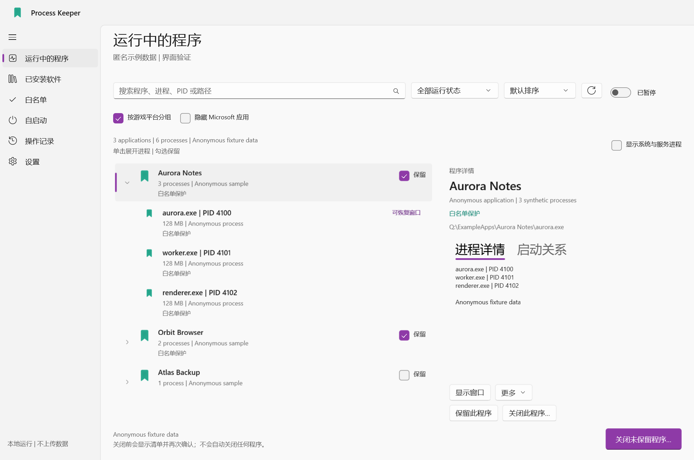
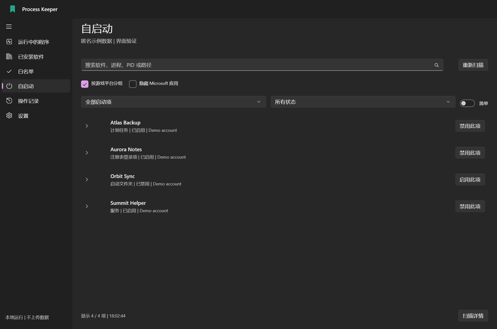
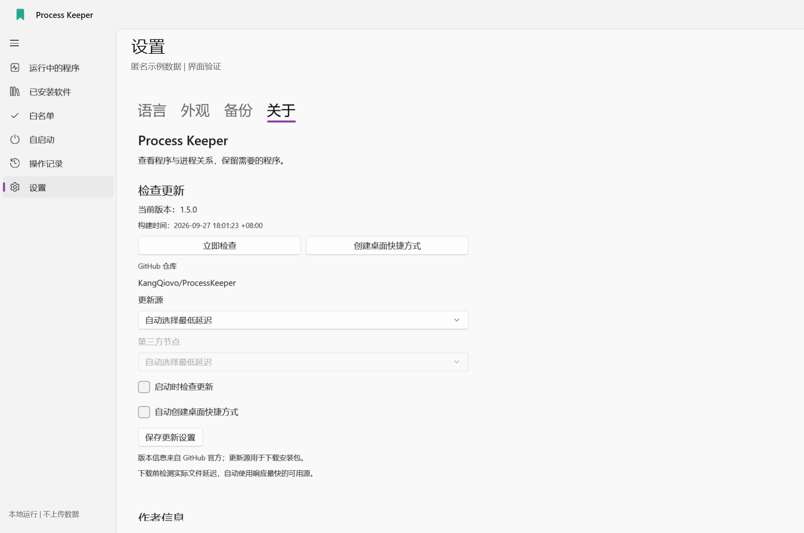
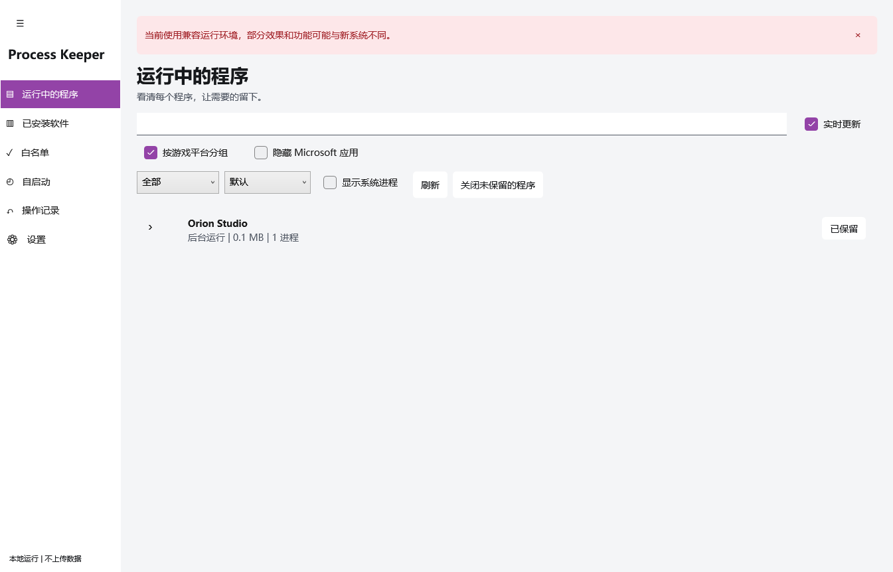
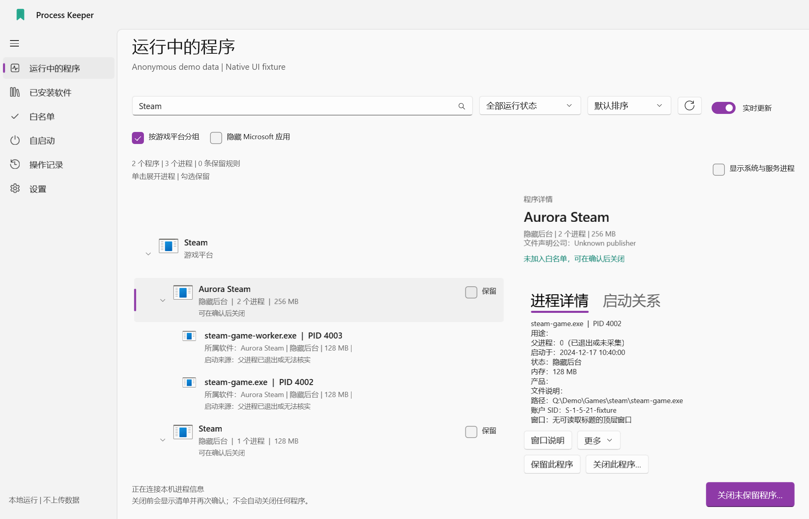
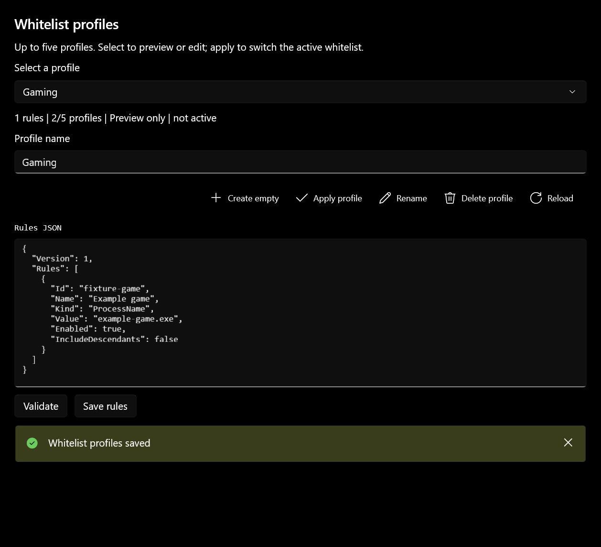

  
  <h1>Process Keeper</h1>
  
看清正在執行的軟體，保留需要的程式，確認後再關閉其餘程式。

  
<a href="README.md">English</a> | <a href="README.zh-CN.md">简体中文</a> | <strong>繁體中文</strong>

  
<a href="LICENSE">MIT 開源</a> | <a href="docs/COMPATIBILITY.zh-TW.md">現代與相容介面</a> | <a href="https://github.com/KangQiovo/ProcessKeeper/issues">歡迎回報</a>

Process Keeper 是 Windows 軟體與處理程序管理工具，提供可編輯的白名單、啟動項目管理，以及針對部分隱藏視窗的還原功能。相關處理程序依所屬軟體分組，讓你在確認操作前看清影響範圍。

現代介面使用 **WinUI 3**；**x86 WPF / WPF UI 相容介面**共用核心邏輯，為舊系統提供另一條執行路線。原生啟動器可將兩套介面封裝成一個免安裝 EXE。

> 從 [Releases](https://github.com/KangQiovo/ProcessKeeper/releases/latest) 下載官方免安裝 EXE。發行套件尚未取得可信程式碼簽章，Windows 可能顯示**未知的發行者**。一般建置保留「測試版本不代表最終品質」提示，官方正式建置會移除。舊系統支援仍是相容目標，不代表已完成所有裝置認證。

## 功能一覽

| 頁面或功能 | 可以做什麼 |
| --- | --- |
| 執行中的程式 | 區分可見、最小化、隱藏與系統/服務處理程序；展開軟體查看身分、記憶體、子程序及視窗。 |
| 已安裝應用程式 | 背景載入目錄，依磁碟篩選，在執行前加入白名單，展開已發現的可執行元件。 |
| 白名單 | 搜尋軟體及處理程序、檢查符合項目、啟停規則，分享通用規則或完整備份。 |
| 設定檔與分組 | 最多五組可編輯的白名單設定檔；依 Steam、Epic Games、Ubisoft Connect、EA app 分組遊戲；可選擇隱藏已驗證的微軟軟體。 |
| 啟動項目 | 切換簡單的一般/隱藏分類及進階來源；對支援的項目確認後備份、重新驗證並啟停。 |
| 隱藏視窗 | 還原已有視窗，或對支援的 AVD、虛擬機器、瀏覽器及通知區域程式提供專用操作。 |
| 設定 | 英文、簡中、繁中；優先跟隨系統語言；佈景主題/材質開關；備份；重新進入導覽。 |
| 操作記錄 | 即時記錄、最早時間在上，顯示年份、毫秒、時區，可選自動捲動。 |
| 更新 | 固定官方儲存庫，呈現真實更新說明與附件、選擇下載來源、驗證更新交接及建立桌面捷徑。 |

## 介面截圖

以下為現代 Windows 主機上實際執行的隔離 UI 截圖，採匿名示範資料。不是設計圖，**也不代表在 Windows 7 上執行的證據**。完整應用程式視窗採用正式渠道建置。

*展開軟體，直觀看到軟體與其處理程序的關係。*

| 啟動項目管理 | 設定與更新 |
| --- | --- |
|  |  |
| 修改前確認來源及目前狀態。 | 原生控制項、隨主題調整的內容及明確的更新確認。 |

*相容介面保留主要流程，材質及能力差異在文件中明確說明。*

| 遊戲平台分組 | 白名單設定檔 |
| --- | --- |
|  |  |
| 展開平台、遊戲，再檢視程序；每個軟體保有獨立操作。 | 先預覽、編輯及驗證，再明確套用設定檔。 |

## 開始使用

1. 開啟免安裝 EXE，Windows 會要求系統管理員權限；取消後進入權限提示頁，不進入管理功能。
2. 完成環境檢查和導覽，選擇語言。自動判斷優先採用系統顯示語言。
3. 查看執行中或已安裝的軟體，將需要的程式設為保留；點選列以查看關聯程序或可執行元件。
4. 發起關閉操作並核對具體目標清單。預設要求正常結束，強制結束需明確選擇。
5. 檢視操作記錄。失敗、能力缺失或無法驗證的身分不會計為成功。

**全新安裝的白名單預設為空**，既有使用者保留原本的規則。另一台電腦缺少的軟體只會呈現未符合規則，不會自動安裝或啟動。分享匯出省略本機規則，匯入的本機規則預設停用，等待使用者確認。

在**設定 → 備份**中最多建立**五組具名設定檔**。選取後預覽規則，可編輯 JSON、檢查格式並儲存。點選「套用」並確認後才切換目前白名單；選取其他設定檔不會改變保護範圍，儲存使用中的設定檔也須確認。完整設定備份包含所有設定檔，僅白名單匯出只包含目前規則。

### 軟體、處理程序與搜尋

執行中、已安裝與白名單頁面皆支援軟體名稱、程序名稱、路徑及精確 PID 搜尋。符合子程序時保留所屬軟體，詳細資料可呈現可執行身分、帳戶/工作階段、父 PID、服務及視窗。可讀取時採用原軟體圖示。

安裝目錄依各磁碟的安裝登錄、捷徑及支援的套件中繼資料發現，**不保證找出所有磁碟中的每個可攜 EXE**。未執行軟體顯示已發現的可執行元件及目前關聯程序，不虛構未來的程序樹。

執行中、已安裝及啟動項目清單可依 **Steam、Epic Games、Ubisoft Connect、EA app** 分組。展開平台後檢視各自獨立的軟體列，歸屬依據支援的本機安裝記錄，不使用父子程序關係判斷。平台標題僅用於顯示，展開或收合不會自動保留或關閉整組遊戲；無法識別的遊戲仍顯示為一般項目。「隱藏微軟應用程式」需要驗證發行者或 Windows 元件證據，不能只憑公司名稱判斷，未知項目仍然可見。

只有這三個軟體清單頁提供同步的即時更新開關，暫停不影響操作記錄。清單使用虛擬化、有界快取及背景收集；慢速磁碟或系統提供者仍可能延遲返回。

### 關閉程式與系統保護

執行前重新確認程序身分及保護規則；新啟動或再次出現的程序不會自動加入已確認清單。批次關閉以確認清單為準，不限於目前搜尋的可見項目。

Steam 優先收到經驗證的正常結束要求，但這無法證明遊戲已存檔或 Steam 雲端同步完成。支援的敏感桌面元件具有獨立風險確認及倒數。「忽略風險」模式只在本次執行有效，並持續呈現紅色警告；不會解除身分驗證、關鍵系統程序保護或更新確認。

**操作前請儲存工作。** 關閉程式及修改啟動設定可能中斷工作，系統管理員權限也不保證所有受保護程序都可讀取或控制。

### 啟動項目管理

來源包含 Run/RunOnce、啟動資料夾、排程工作、服務、驅動程式、部分進階登錄機制、WMI 訂閱及支援的套件啟動宣告。有些在登入或特定條件下觸發，不等於開機立即執行。

簡單模式區分一般及其他非系統入口；進階模式呈現詳細來源和受保護項目。不宣稱與工作管理員逐項一致，也無法涵蓋所有持續啟動機制。

支援的項目可確認後啟停；已識別的 Windows 啟動核准記錄保留原命令或捷徑。修改前備份並重新驗證。驅動程式、系統/原則、未知格式及無法安全還原啟動類型的服務保持唯讀並說明原因。修改設定不會立即啟動或結束程式。

### 隱藏視窗

| 情境 | 行為與限制 |
| --- | --- |
| 已有主視窗 | 還原已驗證的圖形視窗，另外回報前景焦點限制。 |
| Android 模擬器 / AVD | 排除終端機、當機處理器及內部輔助視窗，推薦圖形候選。原生視窗重啟需先識別再確認。無需 scrcpy；視窗出現不代表 Android 啟動完成。 |
| 虛擬機器 | 透過支援的 VirtualBox、Hyper-V、VMware 介面識別並連接已有的虛擬機器，受軟體可用性和身分檢查限制。 |
| 無頭瀏覽器 | 部分現代 Chrome/Edge 可透過既有且已驗證的偵錯能力預覽；相容版沒有即時預覽。 |
| 通知區域程式 | 嘗試支援的喚起入口；程式可能再次隱藏或顯示登入頁，送出啟動要求不等於還原成功。 |

## 系統相容性

| 系統 | 介面 | 執行需求 |
| --- | --- | --- |
| Windows 10 2004 / 19041 以上 x64、Windows 11 x64 | WinUI 3 現代介面 | 封裝版內含 .NET / Windows App SDK |
| Windows 7 **SP1** x86/x64、Windows 8.1 x86/x64、較舊或 x86 Windows 10 | x86 WPF 相容介面 | .NET Framework **4.6.2** 或適用的較新 4.x |
| 無 SP1 的 Win7、最初版 Win8、XP、Vista、ARM | 無受支援的管理路線 | 啟動器說明要求 |

**仍存在的問題：** 尚未完成真實 Win7 / Win8.1 / Win10 裝置驗證。相容版缺少 WinRT 套件及其啟動宣告、瀏覽器即時預覽、x64 AVD 環境還原。材質、動畫、字型、顯示卡行為和舊硬體效能可能不同。現代主機的 x86 測試無法證明舊系統相容。

請先閱讀[相容矩陣與已知限制](docs/COMPATIBILITY.zh-TW.md)。歡迎透過 [Issue](https://github.com/KangQiovo/ProcessKeeper/issues/new/choose) 提供重現步驟、截圖及改進建議。

## 免安裝、設定與更新

目標發行形式為包含兩套介面的單一原生 EXE。免安裝指不登錄安裝項目，**不代表零寫入**：驗證後的執行元件使用受限 ProgramData 快取，個人設定及記錄保存在 `%LOCALAPPDATA%\ProcessKeeper`，啟動項目備份使用受保護的 ProgramData 目錄。

僅白名單與完整設定是兩種匯出格式。匯入先預覽，不會把本機路徑規則擅自擴大成程序名稱規則。設定檔編輯採用版本驗證與單一檔案的不可分割儲存，過期編輯不會覆寫較新的規則。完整設定匯入保存備份，寫入失敗時嘗試復原，但無法保證突然斷電時的多檔案不可分割提交。

更新身分在設定、官方中繼資料、附件及安裝交接中固定為 **`KangQiovo/ProcessKeeper`**。版本身分及摘要來自 GitHub，第三方僅提供允許的下載入口；自動選源實測目標檔案請求。缺少發行版/摘要、速率限制、網路錯誤及無效套件均如實呈現，重新啟動需確認。

建置時間精確到秒，以 UTC+8 為基準，介面每五秒依電腦目前時區更新。目前建置未簽章，摘要及固定儲存庫無法絕對防止他人重寫 EXE。真實公開版本升級及正式 UAC/快取首次啟動仍待現場驗證。

## 編譯與參與

- [原始碼建置](docs/BUILDING.zh-TW.md)：現代、相容、原生封裝步驟。
- [測試說明](docs/TESTING.zh-TW.md)：測試夾具、證據及尚未驗證的範圍。
- [貢獻指南](CONTRIBUTING.zh-TW.md)：修正、翻譯、無障礙和舊系統回報。
- [安全說明](SECURITY.zh-TW.md)：回報建議及敏感資料處理。

儲存庫僅包含原始碼、通用規則範例、文件及截圖，不提交二進位、測試套件、快取、個人規則與記錄，也不自動發佈 EXE。

## 作者、致謝與授權

作者 **KangQi**：[GitHub](https://github.com/KangQiovo) | [酷安](https://www.coolapk.com/u/21241695) | [Bilibili](https://space.bilibili.com/329073257)。

參考及使用 [Microsoft WinUI Gallery](https://github.com/microsoft/WinUI-Gallery)、[Windows App SDK](https://github.com/microsoft/WindowsAppSDK)、[.NET](https://github.com/dotnet/runtime)、[WPF UI](https://github.com/lepoco/wpfui)。元件、圖示與授權見[第三方聲明](THIRD-PARTY-NOTICES.zh-TW.md)。本專案獨立於 Microsoft 及清單中顯示的軟體。

原始碼採用 [MIT 授權](LICENSE)，第三方元件保留各自授權與商標權。應用程式圖示由 AI 產生；截圖來自實際介面，並非生成圖片。
